# India-TS System Component Diagram
Generated: 2025-09-02

## System Architecture Overview

```mermaid
graph TB
    subgraph "Data Sources"
        KITE[Zerodha Kite API]
        EXCEL[Ticker.xlsx<br/>606 Stocks]
        CONFIG[config.ini]
    end

    subgraph "Scanners Layer"
        subgraph "Daily Scanners"
            UNIFIED[Unified Reversal Daily<br/>Every 30 min]
            BREADTH[Market Breadth Scanner<br/>Every 30 min]
            REGIME[Market Regime Analyzer<br/>Every 5 min]
        end
        
        subgraph "Hourly Scanners"
            LHOURLY[Long Reversal Hourly<br/>Every 30 min]
            SHOURLY[Short Reversal Hourly<br/>Every 30 min]
        end
        
        subgraph "Momentum Scanners"
            VSR[VSR Momentum Scanner<br/>Every 60 min]
        end
        
        subgraph "FNO Scanners"
            KCUPPER[KC Upper Limit FNO<br/>Daily @ 1:30 PM]
            KCLOWER[KC Lower Limit FNO<br/>Daily @ 1:30 PM]
        end
    end

    subgraph "Data Storage"
        subgraph "Results Files"
            DAILY_LONG[results/<br/>Long_Reversal_Daily_*.xlsx]
            DAILY_SHORT[results-s/<br/>Short_Reversal_Daily_*.xlsx]
            HOURLY_LONG[results-h/<br/>Long_Reversal_Hourly_*.xlsx]
            HOURLY_SHORT[results-s-h/<br/>Short_Reversal_Hourly_*.xlsx]
        end
        
        subgraph "Persistence Files"
            VSR_PERSIST[vsr_ticker_persistence.json]
            VSR_LONG[vsr_ticker_persistence_hourly_long.json]
            VSR_SHORT[vsr_ticker_persistence_hourly_short.json]
            REGIME_DATA[regime_history.json<br/>performance_metrics.json]
            BREADTH_DATA[market_breadth_latest.json]
        end
    end

    subgraph "Tracker Services"
        VSR_TRACK[VSR Tracker Service<br/>Enhanced]
        HOURLY_TRACK[Hourly Tracker Service<br/>Fixed]
        SHORT_TRACK[Hourly Short Tracker<br/>Service]
        MOMENTUM_TRACK[Short Momentum<br/>Tracker Service]
    end

    subgraph "Alert Services"
        TELEGRAM[VSR Telegram Alerts<br/>Enhanced]
        BREAKOUT[Hourly Breakout<br/>Alerts]
    end

    subgraph "Dashboards"
        subgraph "Web Dashboards"
            VSR_DASH[VSR Dashboard<br/>Port 3001]
            HOURLY_DASH[Hourly Tracker<br/>Port 3002]
            SHORT_DASH[Short Momentum<br/>Port 3003]
            HOURLY_SHORT_DASH[Hourly Short<br/>Port 3004]
            BREADTH_DASH[Market Breadth<br/>Port 8080]
            REGIME_DASH[Market Regime<br/>Enhanced]
        end
    end

    subgraph "Scheduler"
        LAUNCHCTL[LaunchControl<br/>33 Scheduled Jobs]
        PREMARKET[Pre-Market Setup<br/>pre_market_setup_robust.sh]
    end

    %% Data Flow Connections
    KITE --> UNIFIED
    KITE --> LHOURLY
    KITE --> SHOURLY
    KITE --> VSR
    KITE --> BREADTH
    KITE --> REGIME
    KITE --> KCUPPER
    KITE --> KCLOWER
    
    EXCEL --> UNIFIED
    EXCEL --> LHOURLY
    EXCEL --> SHOURLY
    EXCEL --> VSR
    
    CONFIG --> UNIFIED
    CONFIG --> VSR
    CONFIG --> REGIME
    
    %% Scanner to Storage
    UNIFIED --> DAILY_LONG
    UNIFIED --> DAILY_SHORT
    LHOURLY --> HOURLY_LONG
    SHOURLY --> HOURLY_SHORT
    VSR --> VSR_PERSIST
    REGIME --> REGIME_DATA
    BREADTH --> BREADTH_DATA
    
    %% Storage to Services
    DAILY_LONG --> VSR_TRACK
    DAILY_SHORT --> MOMENTUM_TRACK
    HOURLY_LONG --> HOURLY_TRACK
    HOURLY_SHORT --> SHORT_TRACK
    VSR_PERSIST --> VSR_TRACK
    VSR_LONG --> HOURLY_TRACK
    VSR_SHORT --> SHORT_TRACK
    
    %% Services to Dashboards
    VSR_TRACK --> VSR_DASH
    HOURLY_TRACK --> HOURLY_DASH
    SHORT_TRACK --> HOURLY_SHORT_DASH
    MOMENTUM_TRACK --> SHORT_DASH
    BREADTH_DATA --> BREADTH_DASH
    REGIME_DATA --> REGIME_DASH
    
    %% Services to Alerts
    VSR_TRACK --> TELEGRAM
    HOURLY_TRACK --> BREAKOUT
    
    %% Scheduler Control
    LAUNCHCTL --> UNIFIED
    LAUNCHCTL --> LHOURLY
    LAUNCHCTL --> SHOURLY
    LAUNCHCTL --> VSR
    LAUNCHCTL --> REGIME
    LAUNCHCTL --> BREADTH
    PREMARKET --> VSR_TRACK
    PREMARKET --> HOURLY_TRACK
    PREMARKET --> SHORT_TRACK
    
    style KITE fill:#e1f5fe
    style UNIFIED fill:#fff9c4
    style VSR fill:#fff9c4
    style REGIME fill:#fff9c4
    style VSR_DASH fill:#c8e6c9
    style HOURLY_DASH fill:#c8e6c9
    style SHORT_DASH fill:#c8e6c9
    style BREADTH_DASH fill:#c8e6c9
    style REGIME_DASH fill:#c8e6c9
    style TELEGRAM fill:#ffccbc
    style LAUNCHCTL fill:#d1c4e9
```

## Component Descriptions

### 1. Data Sources
- **Zerodha Kite API**: Real-time and historical market data
- **Ticker.xlsx**: Master list of 606 stocks to scan
- **config.ini**: API credentials and system configuration

### 2. Scanners Layer

#### Daily Scanners
- **Unified Reversal Daily**: Combines Long & Short reversal patterns (30-min schedule)
  - Output: `/results/` and `/results-s/`
  - Efficiency: Saves ~606 API calls per run

#### Hourly Scanners  
- **Long/Short Reversal Hourly**: Intraday patterns on hourly timeframes
  - Output: `/results-h/` and `/results-s-h/`
  - Schedule: Every 30 minutes during market hours

#### Momentum Scanners
- **VSR Momentum Scanner**: Volume Spread Ratio analysis
  - Direct output to persistence files
  - Schedule: Every 60 minutes

#### Market Analysis
- **Market Breadth Scanner**: Tracks stocks above/below SMAs
- **Market Regime Analyzer**: Determines market conditions (5-min updates)

### 3. Data Storage

#### Results Files
- Excel files with timestamp-based naming
- Organized by scanner type and direction (long/short)

#### Persistence Files
- JSON-based state management
- Real-time updates for tracker services

### 4. Tracker Services
- **VSR Tracker Enhanced**: Monitors VSR patterns and momentum
- **Hourly Tracker Fixed**: Tracks Long Reversal Hourly results
- **Hourly Short Tracker**: Tracks Short Reversal Hourly results
- **Short Momentum Tracker**: Monitors short-term momentum shifts

### 5. Alert Services
- **VSR Telegram Alerts**: Real-time alerts for VSR signals
- **Hourly Breakout Alerts**: Notifications for hourly pattern breakouts

### 6. Dashboards
All dashboards auto-refresh and provide real-time monitoring:
- **Port 3001**: VSR Dashboard
- **Port 3002**: Hourly Long Tracker
- **Port 3003**: Short Momentum
- **Port 3004**: Hourly Short Tracker
- **Port 8080**: Market Breadth
- **Market Regime Enhanced**: Comprehensive market analysis

### 7. Scheduler
- **LaunchControl**: 33 scheduled jobs via macOS launchd
- **Pre-Market Setup**: Robust initialization script for daily startup

## Data Flow

1. **Market Data** → Scanners via Kite API
2. **Scanners** → Generate results/persistence files
3. **Tracker Services** → Monitor results and update state
4. **Dashboards** → Display real-time data
5. **Alert Services** → Send notifications based on conditions

## Key Features

### Efficiency Optimizations
- Unified scanner reduces API calls by 50%
- Shared data cache between scanners
- TTL-based cache expiration for real-time updates

### Reliability
- Robust pre-market setup script
- Service health monitoring
- Automatic restart capabilities
- State persistence across restarts

### Scalability
- Modular component design
- Independent service operation
- Parallel processing capabilities
- Queue-based alert system

## System Dependencies

### Python Libraries
- kiteconnect: Market data API
- pandas/numpy: Data processing
- streamlit: Some dashboards
- asyncio: Asynchronous operations

### System Requirements
- macOS (for launchctl scheduling)
- Python 3.9+
- 4GB+ RAM for full operation
- Network connectivity for API access

## Current Active Components (as of 2025-09-02)

### Running Services
- VSR Tracker Enhanced
- Hourly Tracker Service Fixed
- Hourly Short Tracker Service
- Short Momentum Tracker Service
- All 6 dashboards active

### Schedule Status
- Unified Reversal: Active (every 30 min)
- Hourly Reversals: Active (every 30 min)
- VSR Scanner: Active (every 60 min)
- Market Regime: Active (every 5 min)
- Market Breadth: Active (every 30 min)

## Notes
- All timestamps in IST (Asia/Kolkata)
- Market hours: 9:15 AM - 3:30 PM IST
- Pre-market setup runs before 9:15 AM
- Services auto-stop after market close