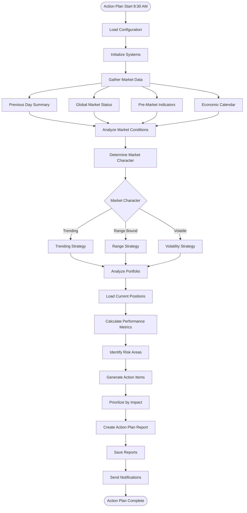
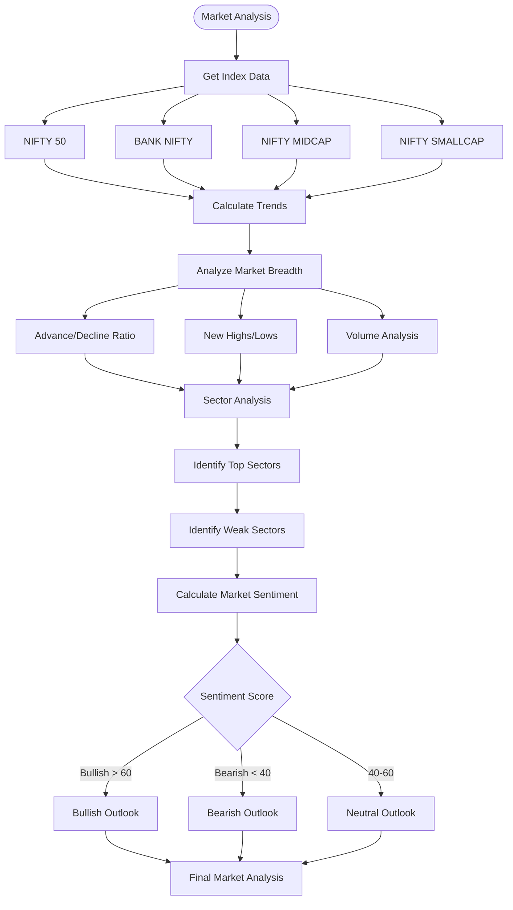
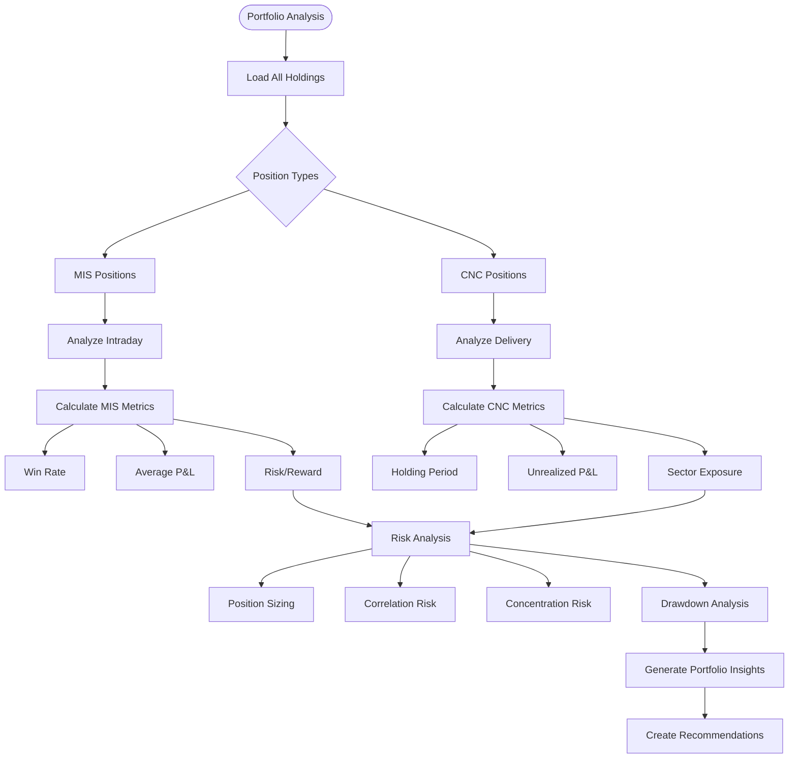
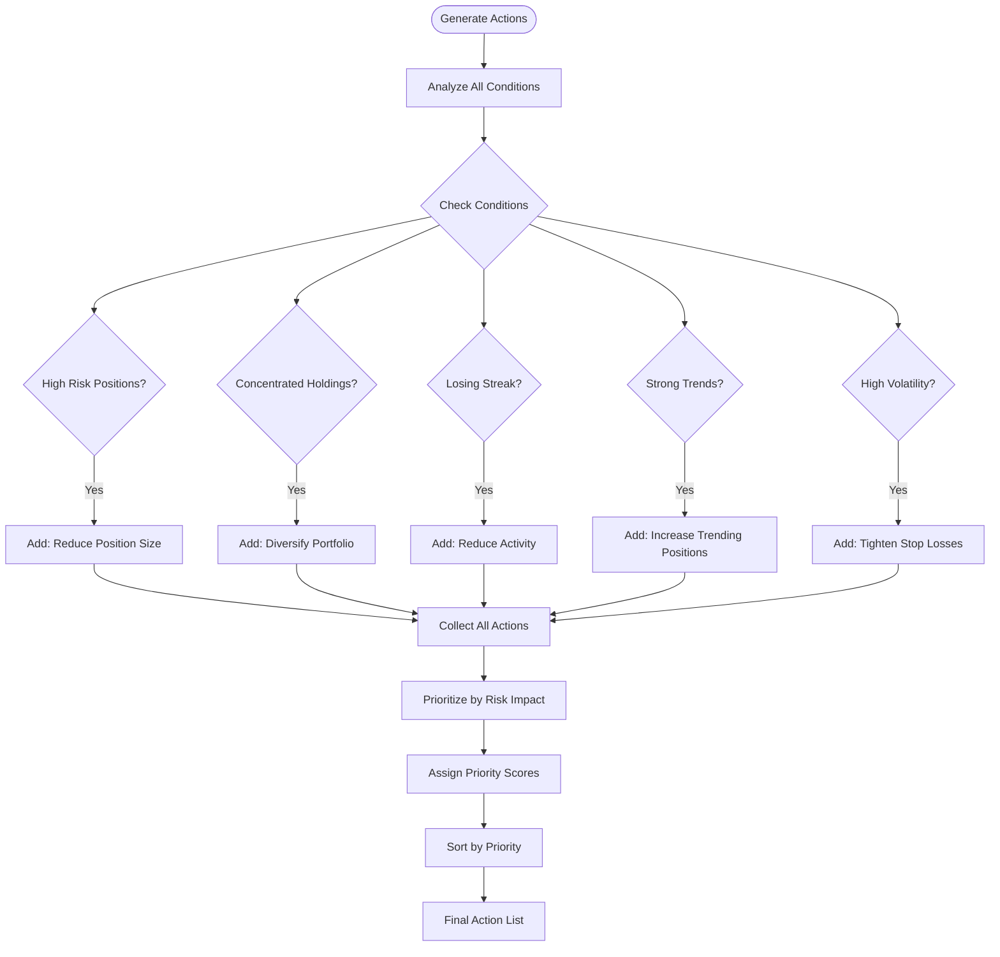
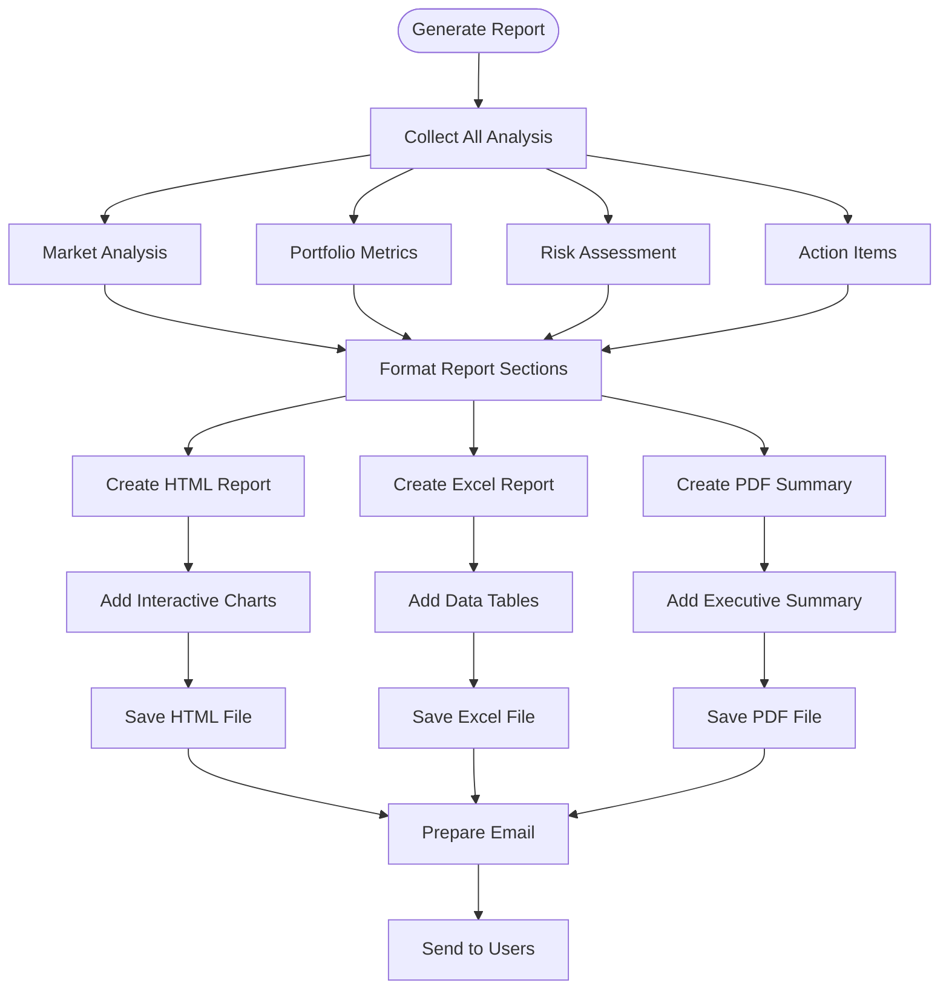
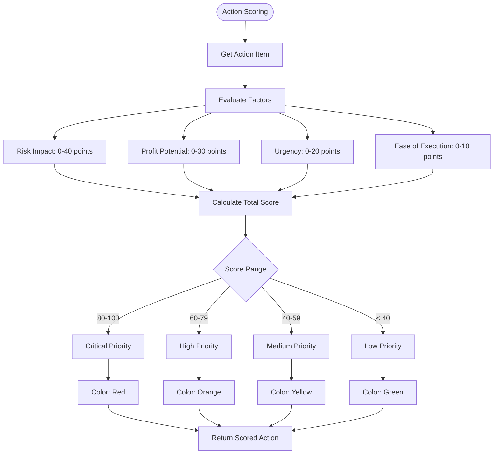
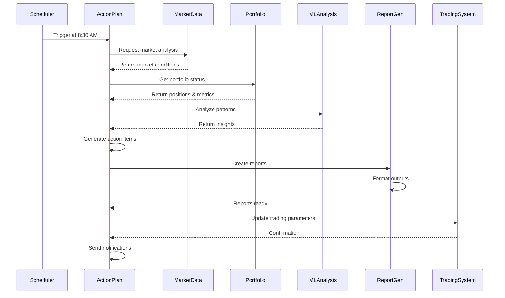
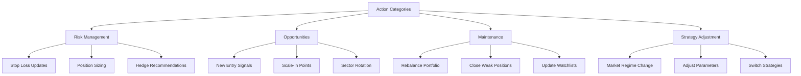

# Action Plan Flow

## Overview
The Action Plan system analyzes market conditions, portfolio performance, and generates daily trading recommendations. It runs every morning at 8:30 AM to prepare traders for the day ahead.

## Main Action Plan Flow

## Market Analysis Flow

## Portfolio Analysis Flow

## Action Generation Logic

## Report Generation Flow

## Action Plan Scoring System

## Integration with Trading System

## Daily Action Categories

