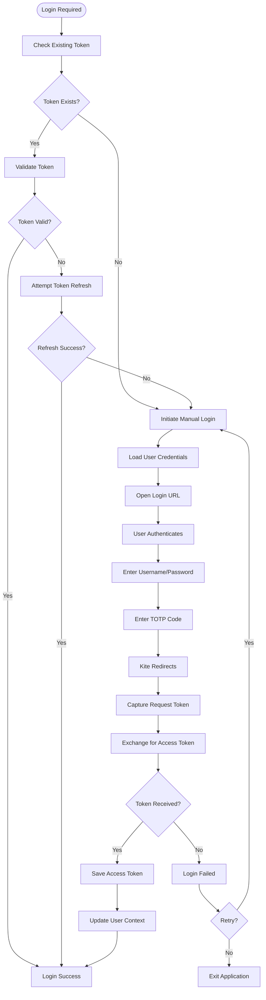
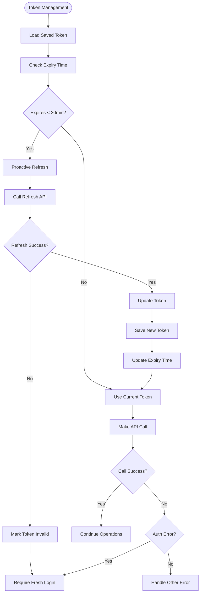
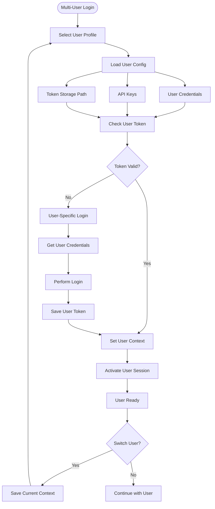
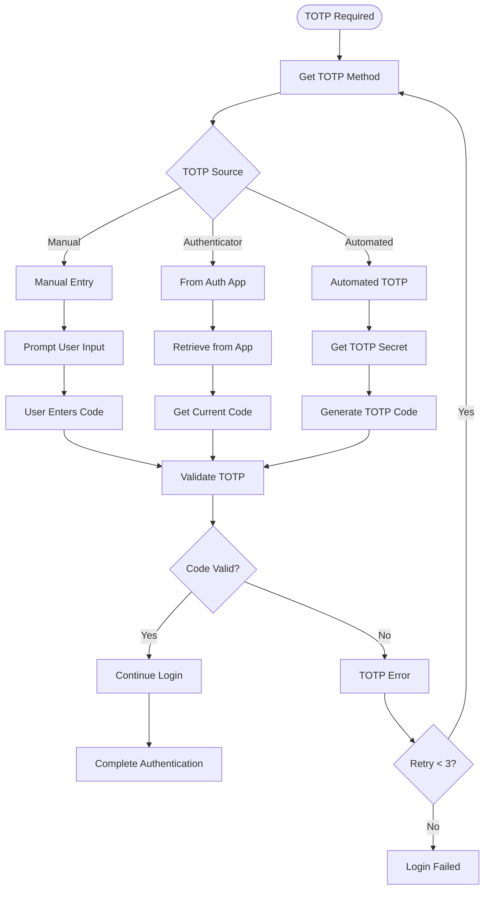
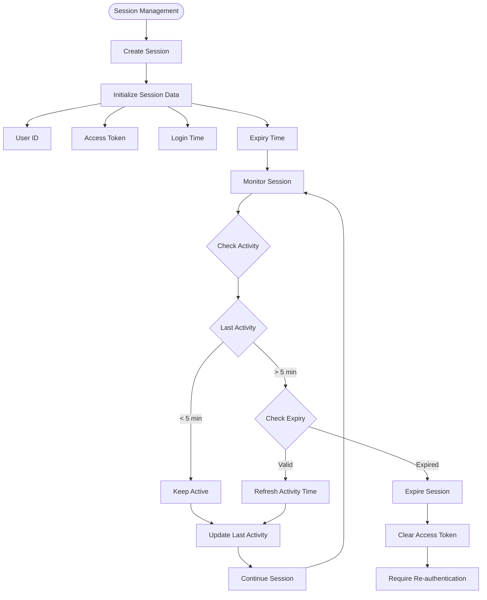
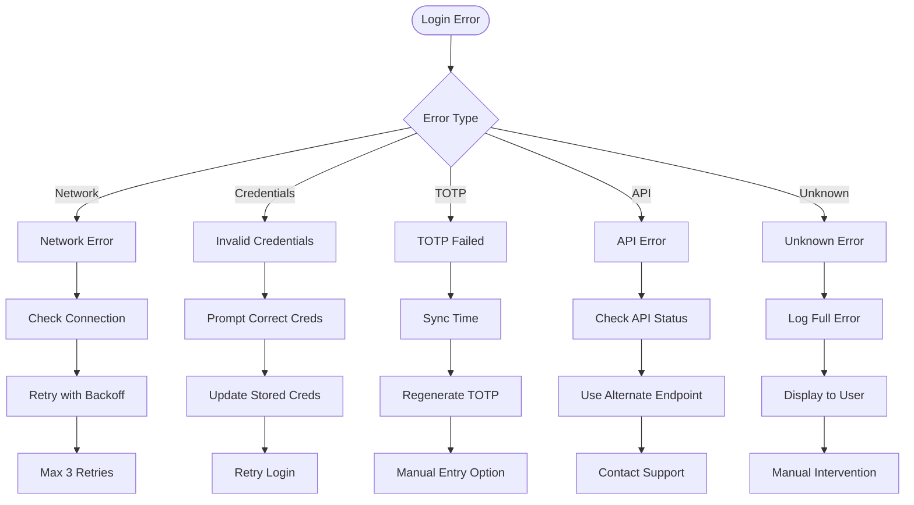
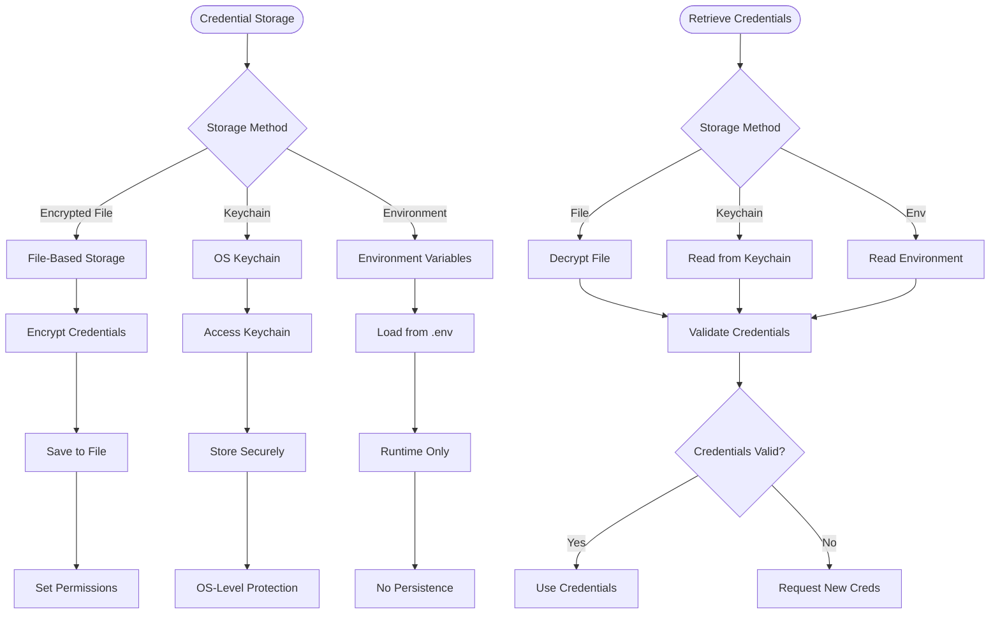
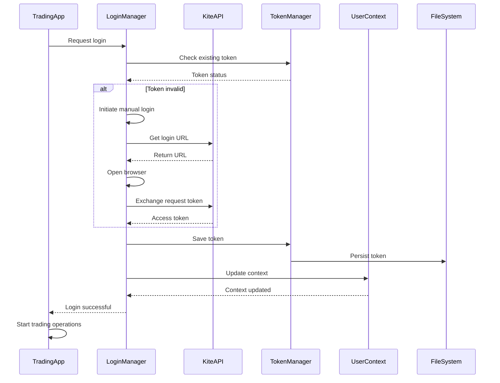

# Login Flow

## Overview
The login system handles authentication with Zerodha Kite API, manages access tokens, and supports multi-user authentication. It includes automatic token refresh and secure credential management.

## Main Login Flow

## Token Management Flow

## Multi-User Login Flow

## TOTP Handling Flow

## Session Management

## Error Handling in Login

## Credential Storage Flow

## Login Integration with Trading System

