# Multi-User Context Flow

## Overview
The multi-user context system allows multiple traders to use the same trading system simultaneously, each with their own credentials, portfolios, and trading parameters. The UserContextManager handles user switching, isolation, and concurrent operations.

## User Context Management Flow

## User Switching Flow

## Multi-User Isolation

## Concurrent User Operations

## User Context Object Structure

## User-Aware Component Flow

## User Directory Structure

## Multi-User Service Architecture

## User Permission System

```mermaid
flowchart TD
    Permissions([User Permissions]) --> PermissionTypes[Permission Categories]
    
    PermissionTypes --> Trading[Trading Permissions]
    PermissionTypes --> Data[Data Access]
    PermissionTypes --> System[System Access]
    PermissionTypes --> Reports[Report Access]
    
    Trading --> T1[Can Trade]
    Trading --> T2[Max Order Size]
    Trading --> T3[Allowed Products]
    Trading --> T4[Allowed Segments]
    
    Data --> D1[View Own Data]
    Data --> D2[View All Data]
    Data --> D3[Export Data]
    Data --> D4[Delete Data]
    
    System --> S1[Change Settings]
    System --> S2[Add Strategies]
    System --> S3[System Admin]
    System --> S4[User Management]
    
    Reports --> R1[View Reports]
    Reports --> R2[Generate Reports]
    Reports --> R3[Share Reports]
    Reports --> R4[Customize Reports]
    
    CheckPermission([Check Permission]) --> LoadUserPerms[Load User Permissions]
    LoadUserPerms --> CheckSpecific{Has Permission?}
    CheckSpecific -->|Yes| AllowAction[Allow Action]
    CheckSpecific -->|No| DenyAction[Deny Action]
    
    DenyAction --> LogAttempt[Log Denied Attempt]
    AllowAction --> LogAccess[Log Allowed Access]
```

## User Context Cleanup

