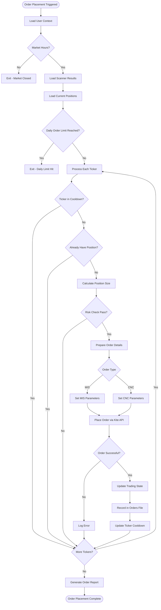
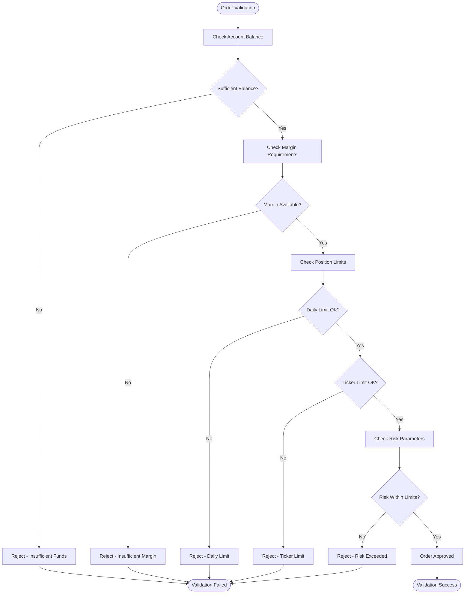
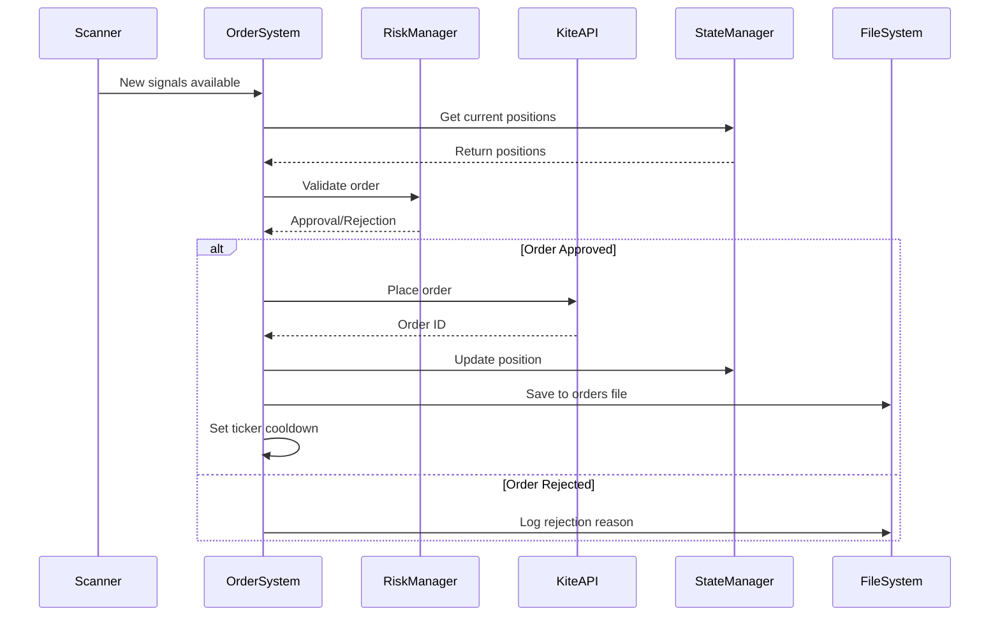
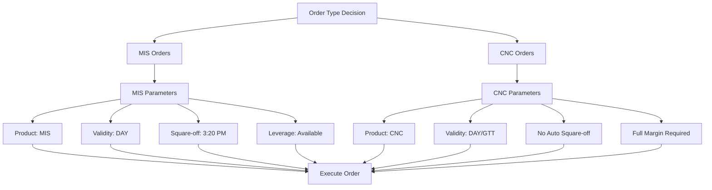
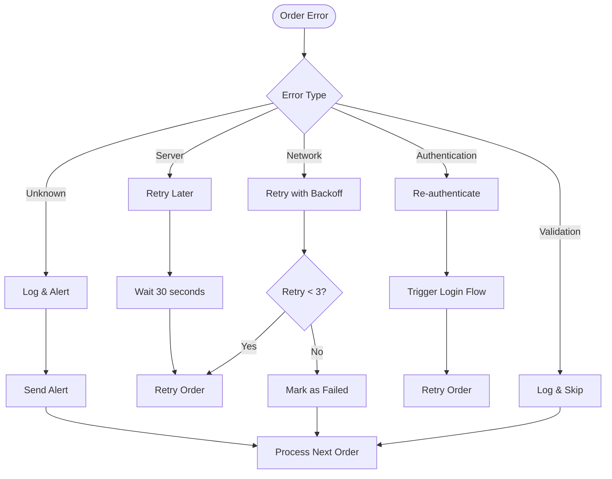
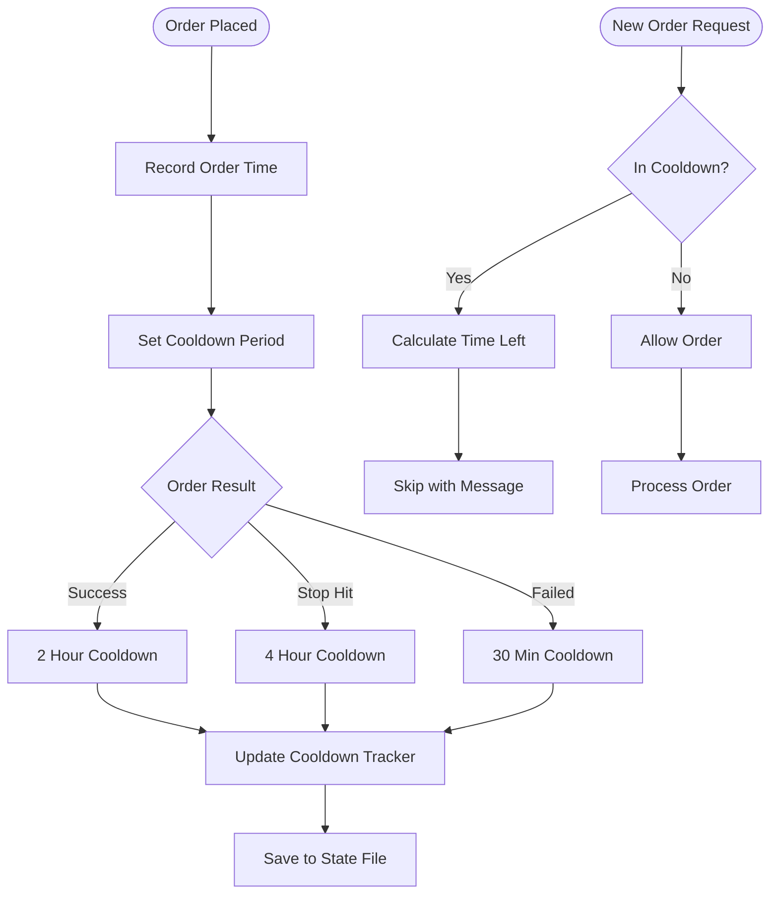

# Order Placement Flow

## Overview
The order placement system processes scanner results and executes trades based on configured strategies and risk parameters. It handles both MIS (intraday) and CNC (delivery) orders.

## Main Order Placement Flow



## Position Size Calculation

```mermaid
flowchart TD
    StartCalc([Calculate Position Size]) --> GetCapital[Get Available Capital]
    GetCapital --> GetRiskParams[Get Risk Parameters]
    
    GetRiskParams --> CalcRisk[Calculate Risk Amount]
    CalcRisk --> GetPrice[Get Current Price]
    GetPrice --> GetStopLoss[Calculate Stop Loss]
    
    GetStopLoss --> CalcShares[Calculate Shares = Risk / (Price - StopLoss)]
    CalcShares --> CheckMin{Shares >= Min Lot?}
    CheckMin -->|No| SetMinLot[Set to Minimum Lot]
    CheckMin -->|Yes| CheckMax{Shares <= Max Position?}
    
    SetMinLot --> FinalSize[Final Position Size]
    CheckMax -->|No| SetMaxSize[Set to Max Position]
    CheckMax -->|Yes| FinalSize
    
    FinalSize --> ReturnSize([Return Position Size])
```

## Order Validation Flow



## Order Execution Sequence



## Order Types and Parameters



## Error Handling Flow



## Cooldown Management

