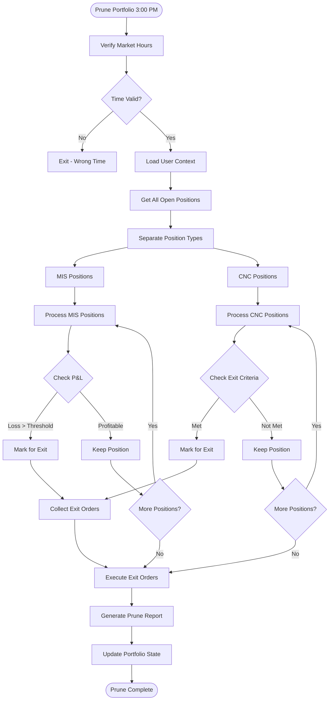
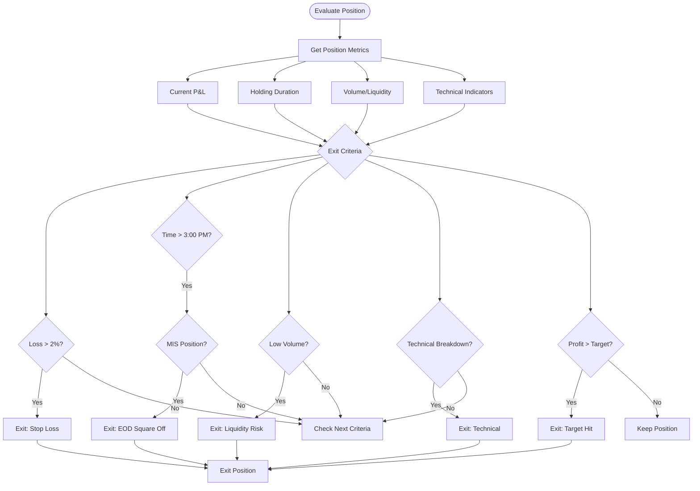
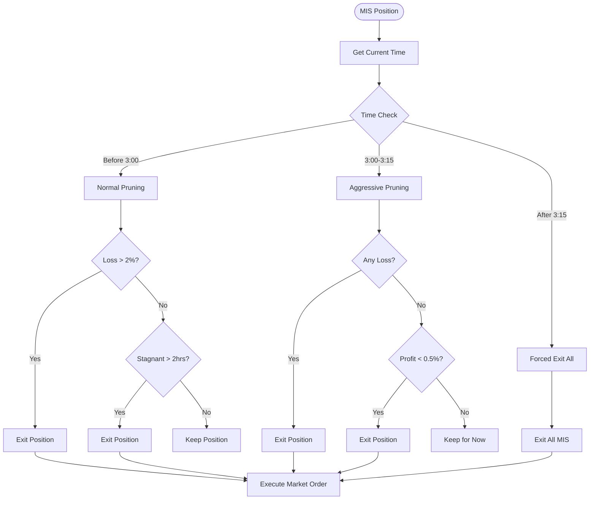
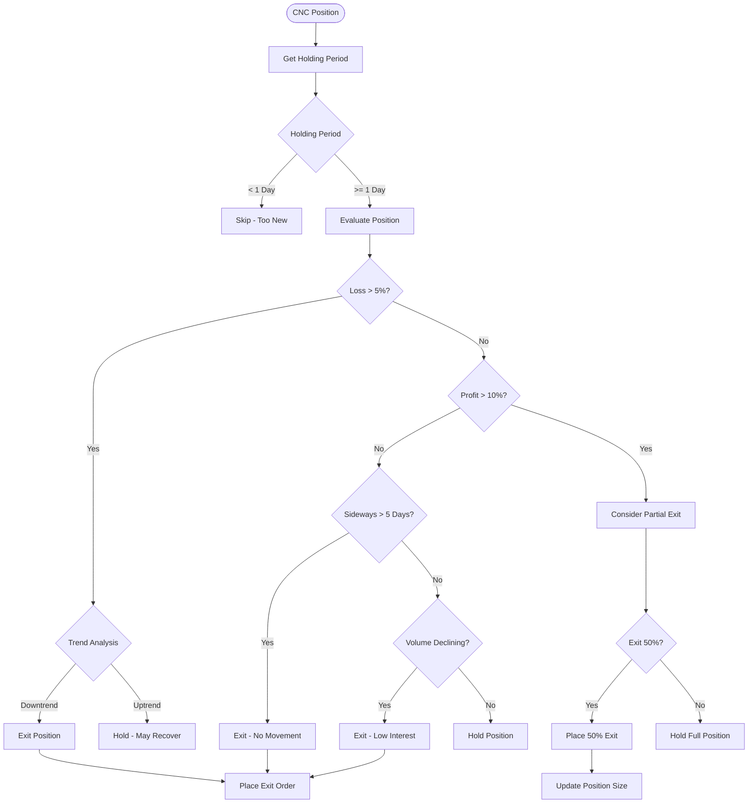
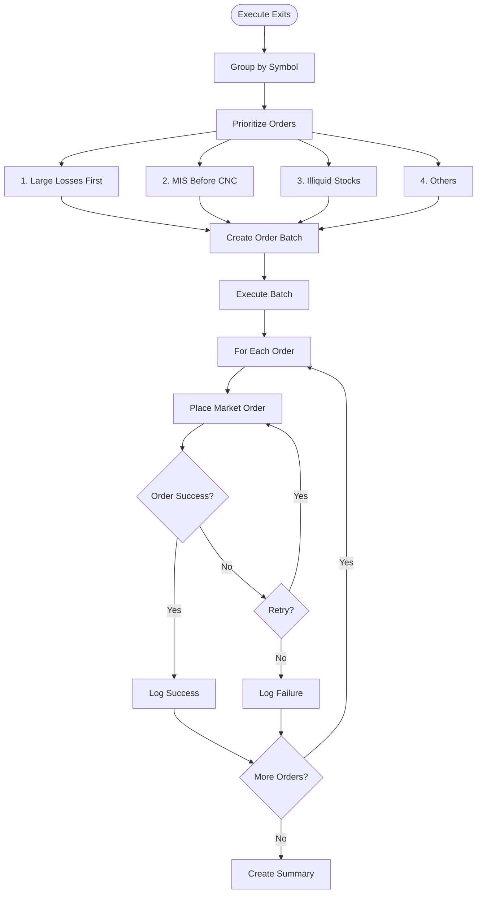
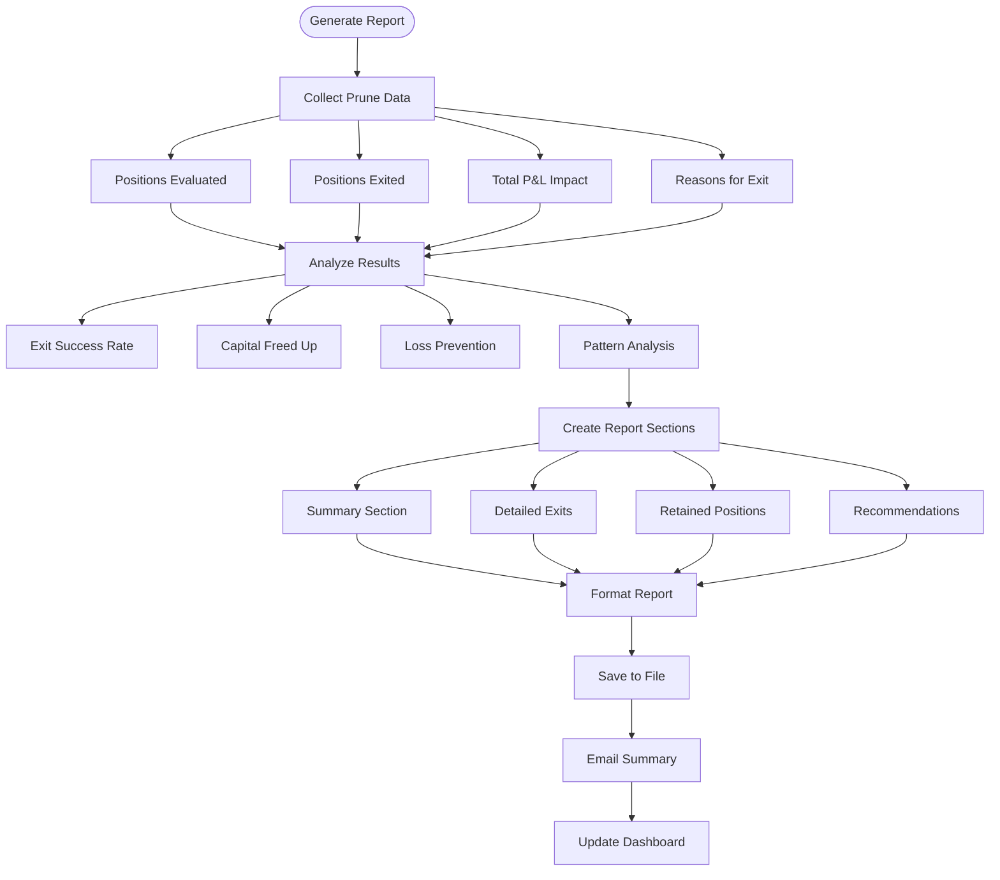
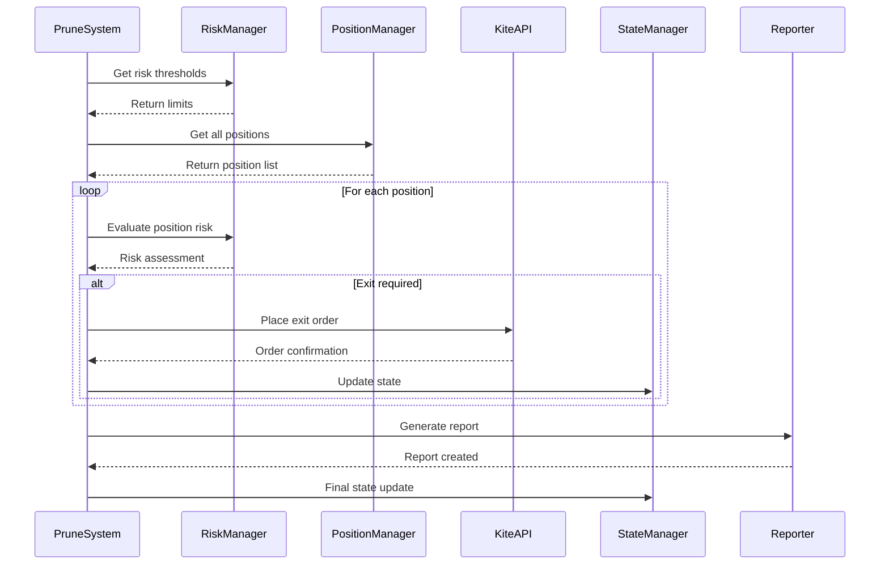
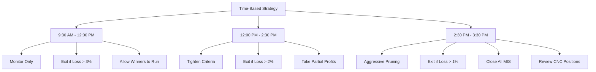

# Prune Portfolio Flow

## Overview
The Prune Portfolio system runs at 3:00 PM daily to clean up losing positions and manage end-of-day portfolio actions. It helps maintain portfolio health by removing underperforming positions before market close.

## Main Prune Portfolio Flow

## Exit Criteria Evaluation

## MIS Position Pruning Logic

## CNC Position Pruning Logic

## Batch Order Execution

## Prune Report Generation

## Integration with Risk Management

## Time-Based Pruning Strategy

