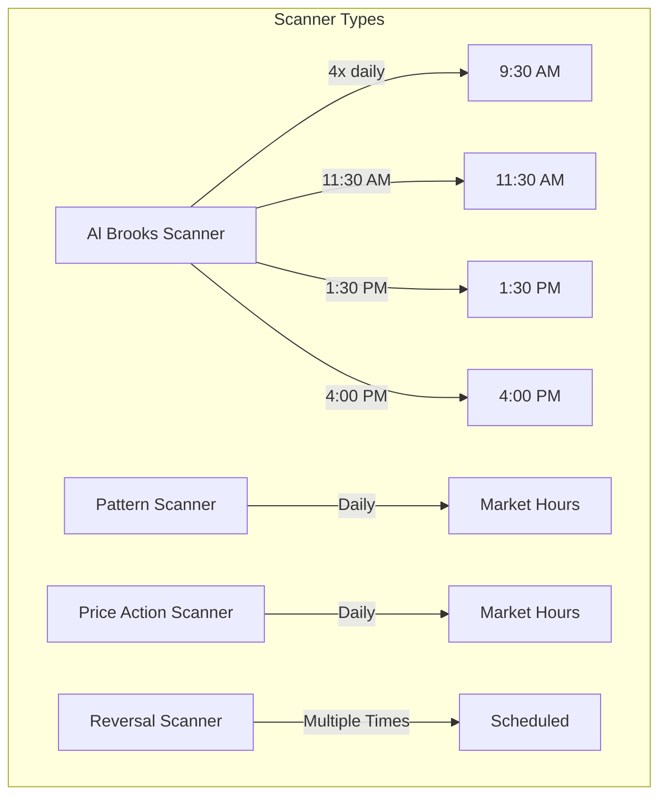
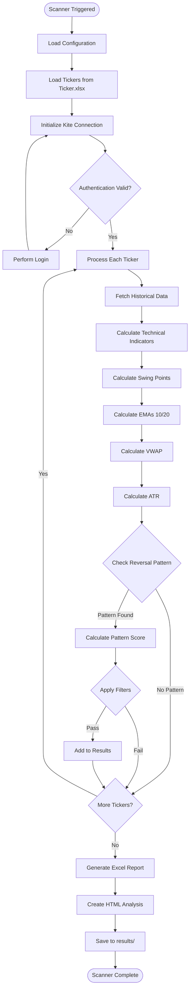
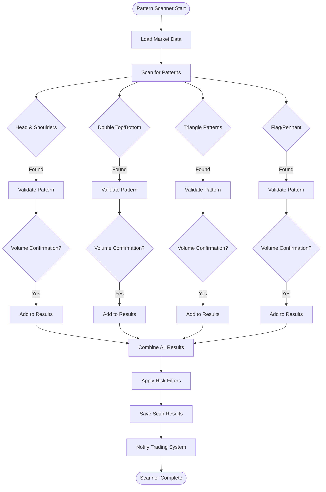
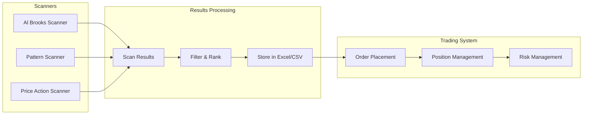
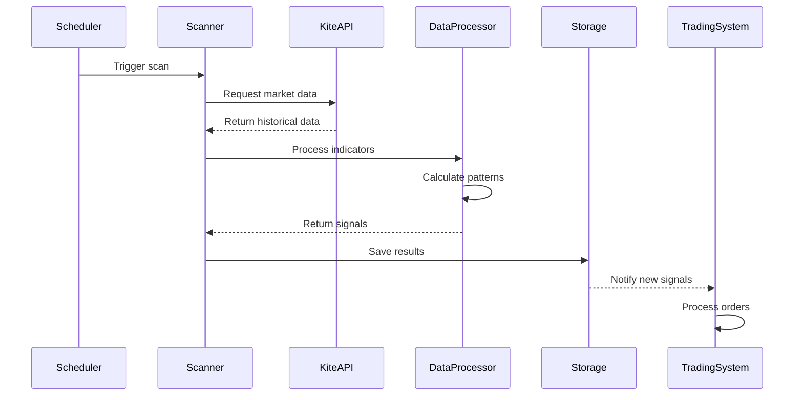
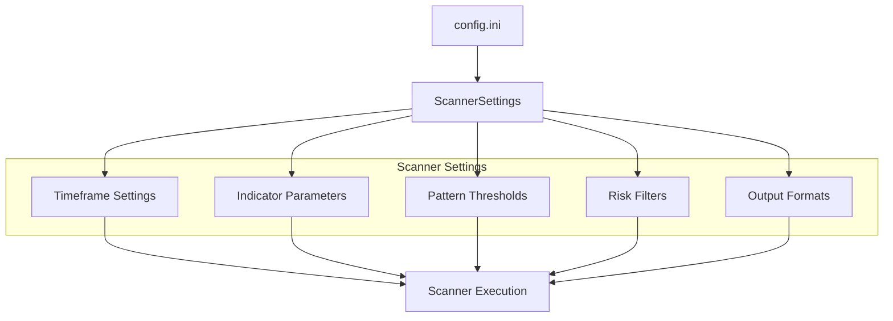

# Scanner Flows

## Overview
The scanner system identifies trading opportunities based on various technical analysis strategies. Multiple scanners run throughout the trading day to capture different market conditions.

## Scanner Types and Execution

## Al Brooks Higher Probability Reversal Scanner Flow

## Pattern Scanner Flow

## Scanner Integration with Trading System

## Scanner Data Flow

## Scanner Configuration

