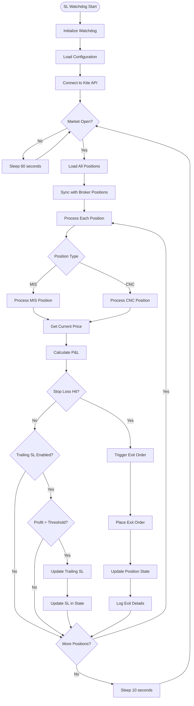
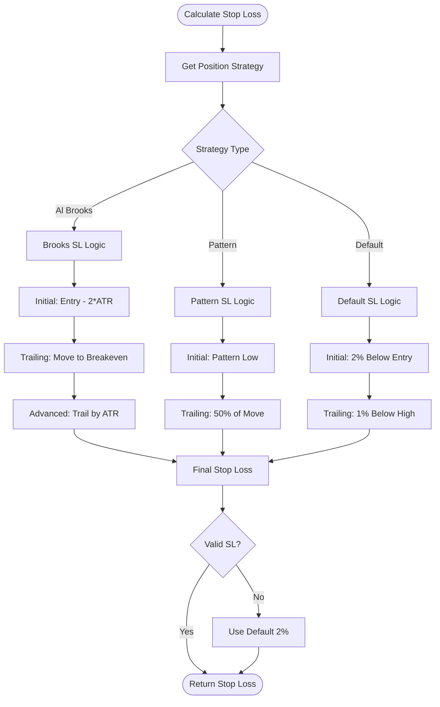
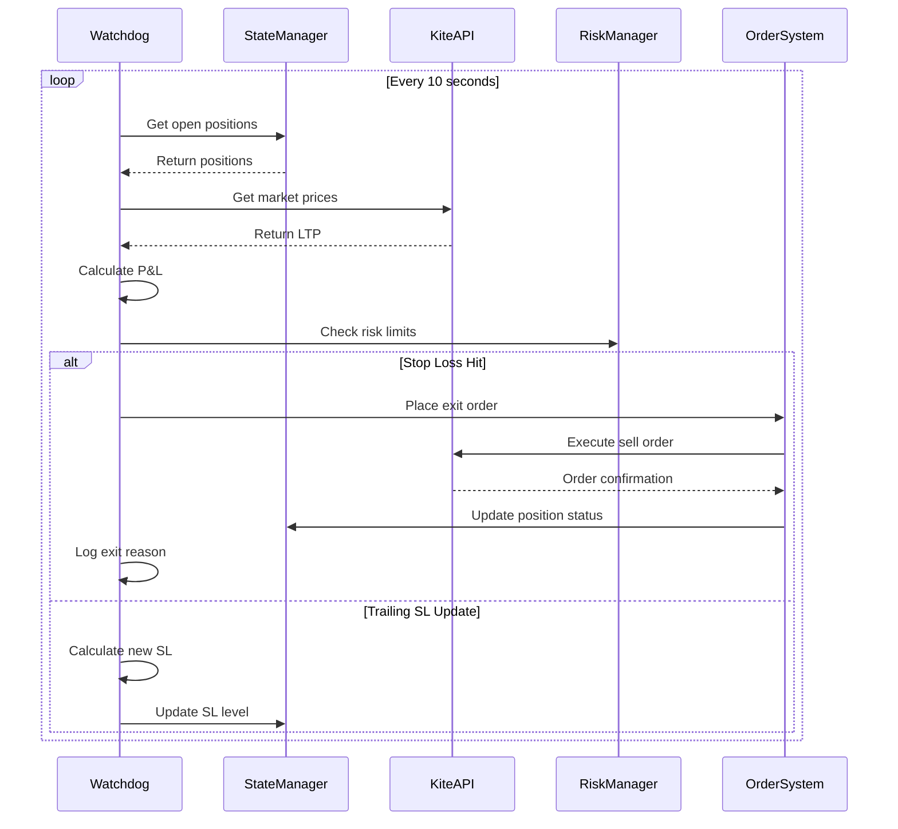
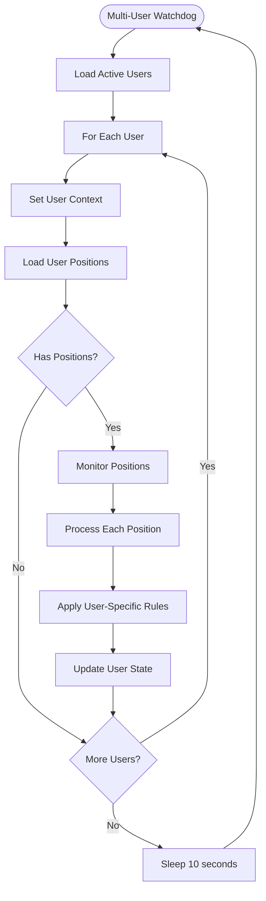
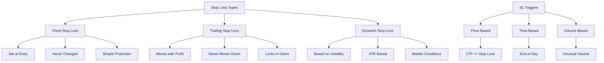
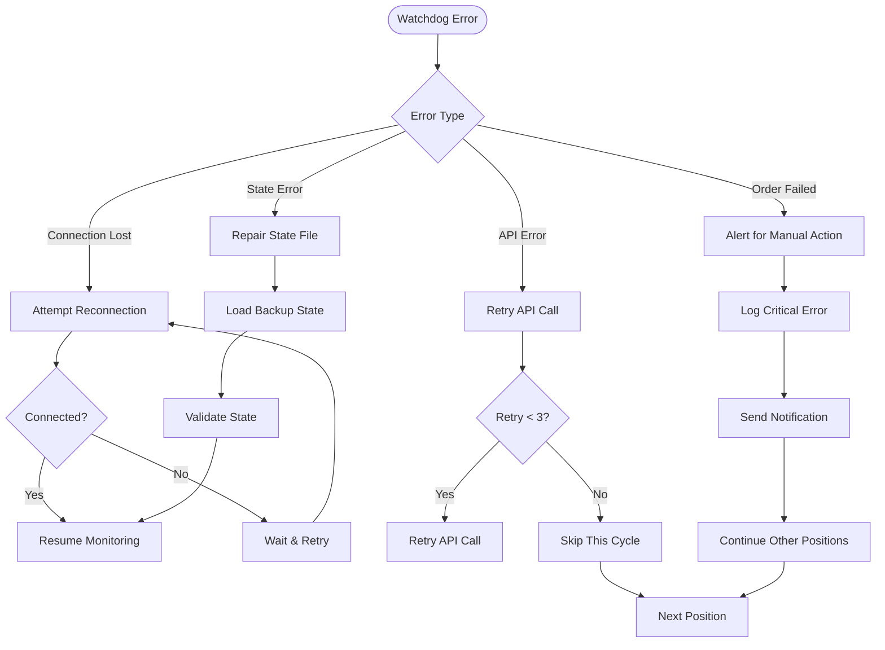
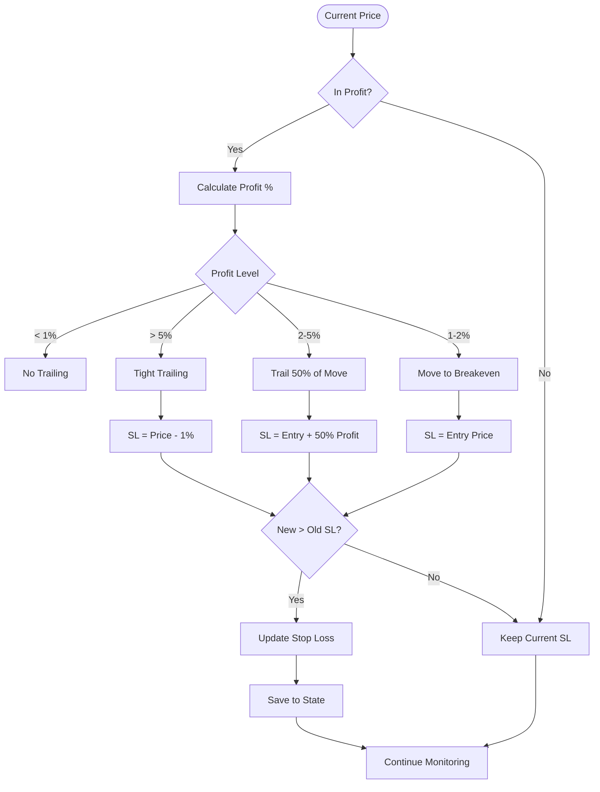
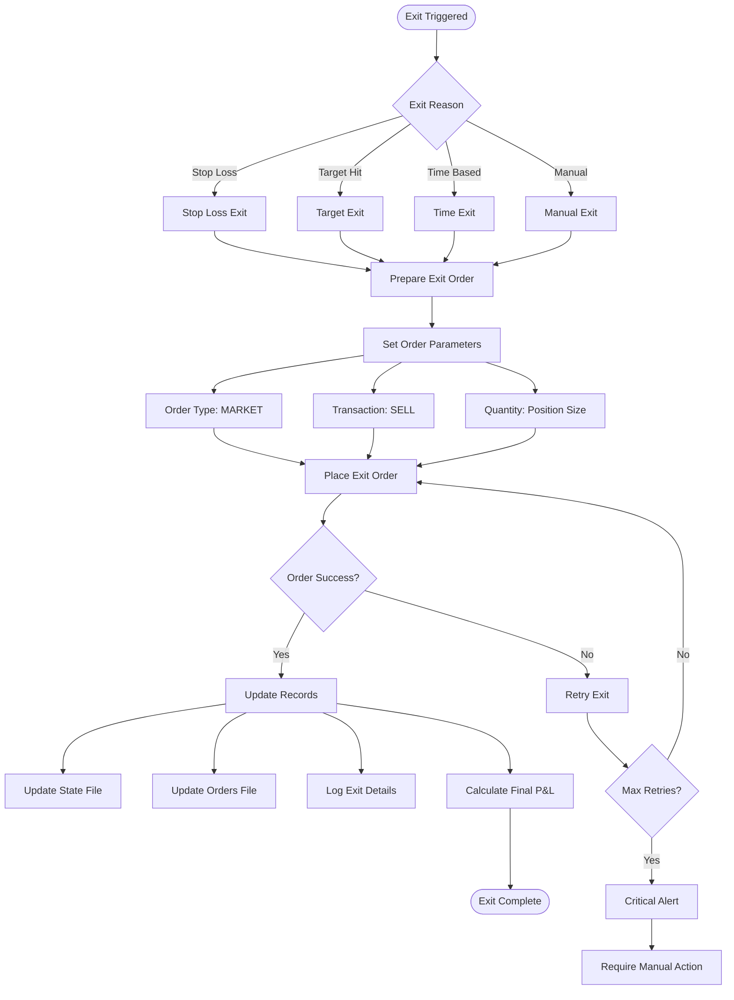

# Stop Loss (SL) Watchdog Flow

## Overview
The SL Watchdog (position_watchdog.py) monitors all open positions and manages stop losses dynamically. It runs continuously during market hours to protect positions and implement trailing stop strategies.

## Main SL Watchdog Flow

## Stop Loss Calculation Logic

## Position Monitoring Sequence

## Multi-User Position Management

## Stop Loss Types and Triggers

## Error Recovery Flow

## Trailing Stop Loss Logic

## Position Exit Flow

