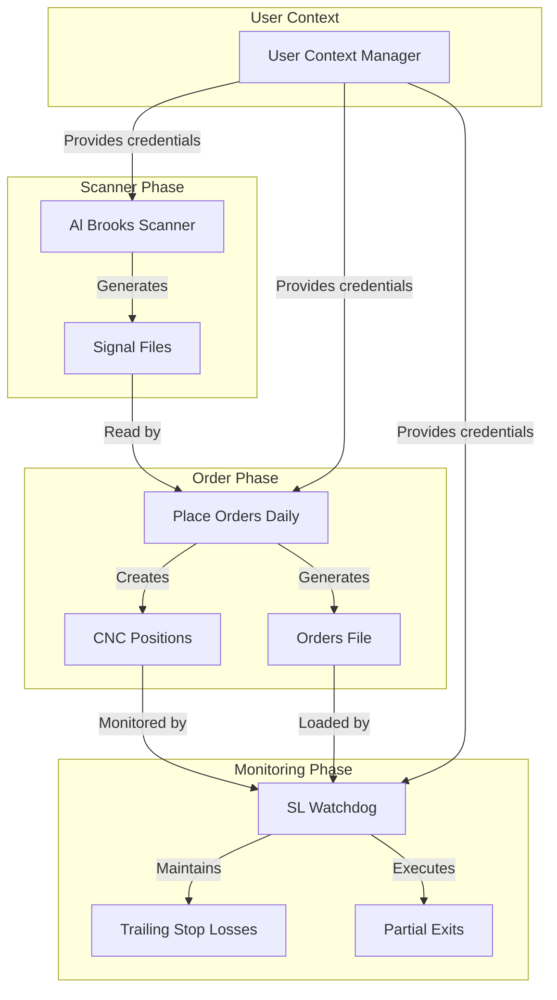

# Daily Trading System Diagrams

This directory contains flow diagrams and documentation for the Daily Trading System components.

## Component Overview

The Daily Trading System consists of three main components that work together to implement an automated trading workflow based on Al Brooks' higher probability reversal patterns:

1. **Al Brooks Scanner** (`Al_Brooks_Higher_Probability_Reversal.py`): Scans the market for high probability reversal patterns and generates trade signals.

2. **Place Orders Daily** (`place_orders_daily.py`): Places CNC (delivery) orders based on the signals generated by the scanner, with proper position sizing and risk management.

3. **SL Watchdog** (`SL_watchdog.py`): Monitors open positions and implements a sophisticated ATR-based trailing stop loss system with partial exit strategy.

## Flow Diagrams

- [Al Brooks Scanner Flow](al_brooks_scanner_flow.md): Describes the process of scanning for higher probability reversal patterns
- [Place Orders Daily Flow](place_orders_daily_flow.md): Details the order placement workflow for CNC positions
- [SL Watchdog Flow](sl_watchdog_flow.md): Explains the ATR-based trailing stop loss and partial exit system

## System Architecture

The system is designed to work with the user context management framework, allowing multiple user accounts to operate independently. Each component is aware of the user context and accesses the appropriate credentials, state data, and trading functions for that user.

## Key Features

1. **User-Specific Operation**: All components support multiple user accounts with isolated state
2. **High Probability Focus**: Scanner filters for patterns with >60% win probability
3. **Intelligent Position Sizing**: Equal capital allocation with percentage-based deployment
4. **Adaptive Stop Losses**: ATR-based stops adjusted for individual stock volatility
5. **True Trailing Stops**: Stops move up with price but never move down
6. **Multi-Tranche Exit**: Partial exits at stop loss and multiple profit targets
7. **Robust Error Handling**: API rate limit management and operation retries
8. **Transparent Reporting**: Detailed logs and HTML/Excel reports for all operations

## Usage Pattern

1. **Daily Morning**: Run Al Brooks Scanner to identify high probability setups
2. **After Scanner**: Run Place Orders Daily to create new CNC positions
3. **Continuous**: Run SL Watchdog to monitor and manage open positions

## Implementation Notes

- All components use the same configuration file (`Daily/config.ini`)
- Each user has their own separate logs directory
- Order files are stored in user-specific directories (`Daily/Current_Orders/USERNAME/`)
- Analysis reports are stored in the `Daily/Detailed_Analysis/` directory