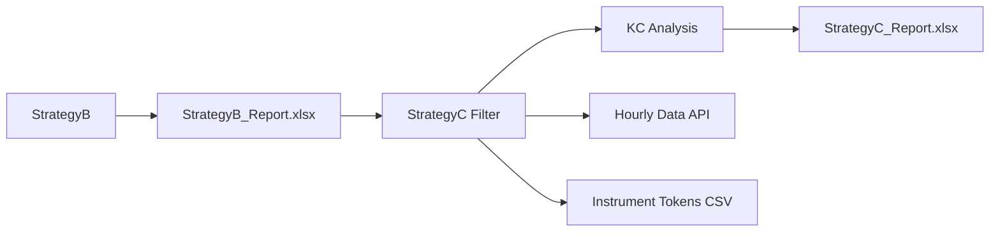

# Trading Strategies Documentation

This document provides comprehensive documentation for the trading strategies implemented in the India-TS Daily trading system.

## Overview

The system implements two complementary strategies:
- **StrategyB**: Al Brooks Higher Probability Reversal Detection
- **StrategyC**: Keltner Channel Breakout Filter

---

## StrategyB: Al Brooks Higher Probability Reversal

**File**: `Daily/scripts/Al_Brooks_Higher_Probability_Reversal.py`

### Purpose
Identifies high-probability reversal setups based on Al Brooks' trading methodology, focusing on confirmed reversals with multiple validations.

### Key Features

#### 1. **Higher Probability Criteria**
- Waits for strong breakout in new direction (confirmed reversal)
- Multiple confirmation bars in new trend
- Break of significant support/resistance with conviction
- Volume expansion on breakout
- Accepts wider stops for higher probability (60%+ win rate target)

#### 2. **Technical Analysis Components**
- **Resistance/Support Break Detection**: Identifies significant level breaks
- **Multiple Confirmation**: Requires multiple bars confirming the new direction
- **Volume Analysis**: Validates breakouts with volume expansion
- **Trend Analysis**: Evaluates trend strength and momentum
- **Risk-Reward Calculation**: Calculates optimal stop loss and target levels

#### 3. **Signal Generation**
```python
# Core reversal conditions checked:
- resistance_break: Break above significant resistance level
- multiple_confirmations: Multiple bars confirming direction
- strong_bodies: Strong candle bodies (not just wicks)
- volume_expansion: Above-average volume on breakout
- trend_support: Supporting trend indicators
- positive_momentum: Momentum in direction of signal
- upper_range_close: Closes in upper portion of range
```

### Output
Generates `StrategyB_Report_{YYYYMMDD}_{HHMMSS}.xlsx` files containing:

#### Columns:
- **Ticker**: Stock symbol
- **Pattern**: Identified pattern type
- **Direction**: LONG/SHORT signal
- **Score**: Probability score (1-10 scale)
- **Entry_Price**: Recommended entry price
- **Stop_Loss**: Calculated stop loss level
- **Target1**: First target level
- **Target2**: Second target level
- **Risk**: Risk percentage
- **Risk_Reward_Ratio**: Risk to reward ratio
- **Volume_Ratio**: Volume expansion ratio
- **Momentum_5D**: 5-day momentum indicator
- **ATR**: Average True Range
- **Description**: Signal description
- **Conditions_Met**: Dictionary of conditions satisfied

### Usage
```bash
python Daily/scripts/Al_Brooks_Higher_Probability_Reversal.py -u Sai
```

### Configuration
- Uses `Daily/config.ini` for API credentials
- Configurable user credentials via command line
- Logs to `logs/al_brooks_higher_probability.log`

---

## StrategyC: Keltner Channel Breakout Filter

**File**: `Daily/scripts/StrategyKV_C_Filter.py`

### Purpose
Filters StrategyB signals by applying Keltner Channel (KC) breakout validation on hourly timeframe, identifying tickers that have breached KC levels since their original signal timestamp.

### Key Features

#### 1. **Multi-Report Analysis**
- Analyzes multiple previous StrategyB reports (user configurable)
- Tracks signals from their original timestamp
- Identifies subsequent KC breakouts

#### 2. **Keltner Channel Implementation**
```python
# KC Calculation (Hourly timeframe):
KC_Middle = 20-period SMA
KC_Upper = KC_Middle + (2 × 20-period ATR)
KC_Lower = KC_Middle - (2 × 20-period ATR)
```

#### 3. **Breakout Detection Logic**
- **LONG signals**: `close >= KC_Upper` (bullish breakout)
- **SHORT signals**: `close <= KC_Lower` (bearish breakdown)
- **Hourly precision**: Detects breakouts on hourly timeframe
- **Timestamp validation**: Only considers breakouts since original signal

#### 4. **Intelligent Filtering**
- **Primary Check**: Scans hourly data since report timestamp
- **Fallback Logic**: If timestamp filtering fails, checks current price vs KC levels
- **Rate Limiting**: Prevents API overload with request delays
- **Error Handling**: Graceful handling of API errors and data issues

### Technical Components

#### Instrument Token Resolution
- Uses local CSV file (`instruments_backup.csv`) for fast symbol-to-token mapping
- Supports both NSE and BSE instruments
- Caches mappings for performance

#### Keltner Channel Calculation
```python
# 20-period calculations on hourly data
SMA20 = close.rolling(20).mean()
TR = max(high-low, abs(high-prev_close), abs(low-prev_close))
ATR = TR.rolling(20).mean()
KC_Upper = SMA20 + (2 * ATR)
KC_Lower = SMA20 - (2 * ATR)
```

#### Breakout Validation
- Precise timestamp filtering from report generation time
- Hourly granularity for faster signal detection
- Direction-aware breakout logic

### Usage

#### Interactive Mode
```bash
python Daily/scripts/StrategyKV_C_Filter.py
```

#### Options
1. **Test Mode**: Test with single ticker (INFY) for debugging
2. **Analysis Mode**: Analyze N previous reports (default: 5)

#### User Prompts
```
Test mode with single ticker? (y/N): n
How many previous StrategyB reports would you like to analyze? (default: 5): 3
```

### Output
Generates `StrategyC_{YYYYMMDD}_{HHMMSS}.xlsx` files with three sheets:

#### 1. KC_Breakouts Sheet
- **All original StrategyB columns**
- **Report_File**: Source StrategyB report
- **Report_Timestamp**: Original signal timestamp
- **Breakout_Date**: When KC breakout occurred
- **Breakout_Price**: Price at breakout
- **KC_Level_at_Breakout**: KC level that was breached
- **Current_Close**: Latest price
- **Current_KC_Upper/Lower**: Current KC levels
- **Days_Since_Report**: Time elapsed since signal
- **Gain_Since_Breakout_Pct**: Performance since breakout

#### 2. Summary Sheet
- Total KC breakouts found
- Long vs Short breakout distribution
- Average scores and risk-reward ratios
- Performance statistics
- Reports analyzed count

#### 3. Top_Performers Sheet
- Top 10 performers by gain since breakout
- Key metrics for best performers

### Integration Workflow



### Performance Optimizations

#### 1. **Rate Limiting**
- 200ms delay between API calls
- Prevents overwhelming Zerodha API

#### 2. **Caching**
- Instrument tokens cached from CSV
- Reduces API calls for symbol resolution

#### 3. **Error Recovery**
- Fallback logic for timestamp issues
- Graceful handling of missing data
- Automatic retry mechanisms

#### 4. **Data Validation**
- Removes NaN values from calculations
- Validates KC calculation results
- Handles non-numeric data gracefully

### Configuration

#### API Setup
```ini
# Daily/config.ini
[API_CREDENTIALS_Sai]
api_key = your_api_key
access_token = your_access_token
```

#### Dependencies
- KiteConnect API access
- `instruments_backup.csv` file for token mapping
- Previous StrategyB reports in `Daily/results/`

### Logging
- Detailed logging to `logs/strategykv_c_filter.log`
- Debug information for timestamp filtering
- KC calculation results
- Breakout detection status

---

## Strategy Combination Benefits

### 1. **Quality Signal Generation**
- StrategyB identifies high-probability reversal setups
- StrategyC validates with momentum-based KC breakouts

### 2. **Risk Management**
- Pre-calculated stop losses and targets from StrategyB
- KC breakout confirmation reduces false signals

### 3. **Timing Optimization**
- StrategyB identifies setup conditions
- StrategyC provides precise entry timing on KC breakout

### 4. **Historical Validation**
- Multi-report analysis shows signal follow-through
- Performance tracking since breakout

### 5. **Scalability**
- Automated analysis across multiple timeframes
- Batch processing of historical signals

---

## Best Practices

### For StrategyB
1. **Review conditions_met**: Understand why each signal qualified
2. **Check risk-reward ratios**: Focus on signals with favorable R:R
3. **Validate volume expansion**: Confirm breakouts have volume support
4. **Monitor score distribution**: Higher scores indicate better setups

### For StrategyC  
1. **Use test mode first**: Validate API connectivity before full analysis
2. **Analyze multiple reports**: Look for consistent breakout patterns
3. **Monitor timestamp accuracy**: Ensure proper filtering from signal time
4. **Track performance metrics**: Review gain since breakout for validation

### Signal Quality Assessment
```python
# High-quality signals typically show:
- StrategyB Score >= 7.0
- Risk-Reward Ratio >= 2.0
- Volume expansion >= 1.5x
- KC breakout within 24-48 hours of signal
- Sustained price action above/below KC levels
```

---

## Troubleshooting

### Common Issues

#### StrategyB
- **No signals generated**: Check market hours and data availability
- **Low scores**: Market may lack strong reversal setups
- **API errors**: Verify credentials in config.ini

#### StrategyC
- **No breakouts found**: Signals may not have had sufficient follow-through
- **Timestamp filtering issues**: Use test mode to debug datetime handling
- **Token lookup failures**: Ensure instruments_backup.csv is current

### Debug Steps
1. **Run test mode** to validate API connectivity
2. **Check log files** for detailed error information  
3. **Verify timestamp alignment** between reports and API data
4. **Validate instrument tokens** for new stocks

---

## File Structure

```
Daily/
├── scripts/
│   ├── Al_Brooks_Higher_Probability_Reversal.py  # StrategyB
│   ├── StrategyKV_C_Filter.py                     # StrategyC
│   └── instruments_backup.csv                     # Token mapping
├── results/
│   ├── StrategyB_Report_*.xlsx                    # StrategyB outputs
│   └── StrategyC_*.xlsx                           # StrategyC outputs
├── logs/
│   ├── al_brooks_higher_probability.log           # StrategyB logs
│   └── strategykv_c_filter.log                    # StrategyC logs
├── config.ini                                     # API credentials
└── Strategy_README.md                             # This documentation
```

---

## Version History

- **v1.0**: Initial StrategyB implementation with Al Brooks methodology
- **v1.1**: Added StrategyC KC filter with hourly breakout detection
- **v1.2**: Enhanced error handling and fallback logic
- **v1.3**: Added multi-report analysis and performance tracking

---

*Last Updated: 2025-06-17*
*Maintained by: India-TS Daily Trading System*