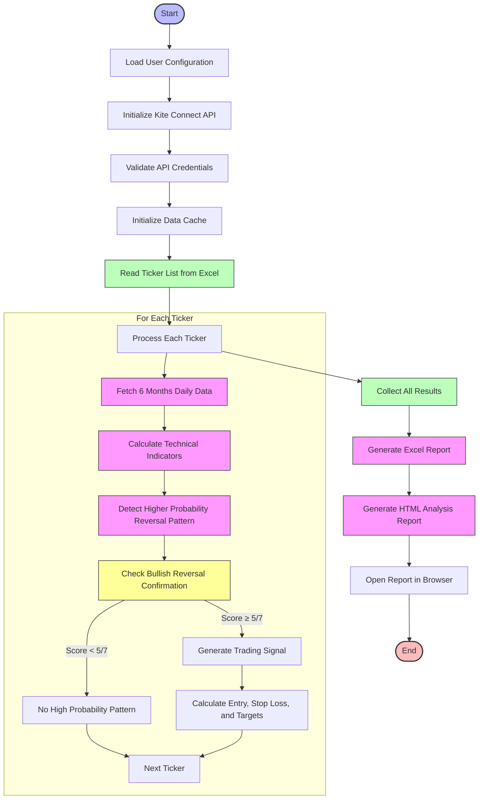

# Al Brooks Higher Probability Reversal Scanner Flow

## Al_Brooks_Higher_Probability_Reversal.py Flow Chart

## Key Components and Logic

### 1. Initialization and Configuration
- **Command Line Arguments**: Accepts user name argument to select appropriate API credentials
- **Configuration Loading**: Reads API credentials from config.ini for specified user
- **API Initialization**: Sets up Zerodha Kite Connect client
- **Data Cache**: Implements caching for instruments data and historical prices

### 2. Technical Indicator Calculation
- **SMA Calculations**: 20, 50, and 200-day Simple Moving Averages for trend identification
- **ATR Calculation**: 14-day Average True Range for volatility measurement
- **Support/Resistance**: Identifies swing highs and lows
- **Volume Analysis**: Volume ratio compared to 20-day average
- **Momentum Indicators**: Rate of Change (ROC) calculations

### 3. Higher Probability Pattern Recognition
- **Bullish Reversal Requirements**:
  - Strong breakout above resistance
  - Multiple confirmation bars (2+ bullish candles)
  - Strong body candles (>60% body/range ratio)
  - Volume expansion (>1.5x average)
  - Trend support (price > SMA20)
  - Positive momentum (5-day ROC > 2%)
  - Close in upper half of range
  
- **Scoring System**: 
  - Score of 5/7 or higher required for signal generation
  - Higher scores indicate higher probability setups (>60% win rate)

### 4. Stop Loss Calculation
- **Wider stop losses** for higher probability trades
- **ATR-Based**: Uses ATR multiplier of 2.5x for volatility-based stops
- **Swing-Based**: Alternative stop below recent swing low

### 5. Risk/Reward Analysis
- **1:2 Risk/Reward** for primary targets
- **1:3 Risk/Reward** for extended targets
- **Risk-Reward Ratio** calculation for each trade opportunity

### 6. Output Generation
- **Excel Output**: Detailed trade specifications saved to results directory
- **HTML Report**: Interactive visual analysis with trade details
- **Automated Browser Opening**: Opens HTML report for immediate viewing

## Key Design Features

1. **User Context-Aware**: Uses credentials for specific user passed as argument
2. **Data Fallback Mechanisms**: Falls back to backup files if API fails
3. **Error Handling**: Comprehensive error handling for API rate limits
4. **Parallel Processing**: Processes tickers efficiently in sequence
5. **AI-Inspired Logic**: Based on Al Brooks' trading principles for higher probability setups
6. **Visually Rich Output**: Creates detailed HTML reports for easy analysis

## Usage Notes

- **Daily Usage**: Designed to be run once daily before market open
- **Signal Filter**: LONG ONLY - currently filters exclusively for bullish setups
- **Wider Stops**: Trades have wider stops for higher probability success rates
- **Higher Win Rate**: Targets 60%+ win rate with careful pattern identification
- **Lower Frequency**: High probability setups are less frequent but more reliable