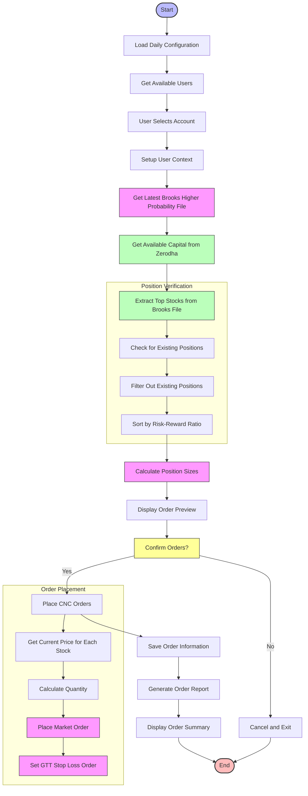

# Daily Order Placement Process Flow

## place_orders_daily.py Flow Chart

## Key Logic Steps in place_orders_daily.py

1. **User Selection and Context Setup**:
   - Loads user credentials from Daily/config.ini
   - Allows interactive selection of user account
   - Sets up user-specific context with correct API credentials
   - Configures user-specific logging

2. **Data Source Processing**:
   - Identifies and loads the most recent Brooks Higher Probability LONG Reversal file
   - Extracts tickers, stop loss levels, target prices, and risk-reward ratios
   - Sorts opportunities by risk-reward ratio (higher ratios preferred)

3. **Position Filtering**:
   - Checks current portfolio for existing positions
   - Skips tickers that already have positions to avoid duplicates
   - Selects top N opportunities based on max_positions config

4. **Capital Allocation**:
   - Fetches available capital from Zerodha account
   - Uses configured percentage of capital (capital_deployment_percent)
   - Divides available capital equally among selected positions
   - Calculates exact position sizes based on current market prices

5. **Interactive Confirmation**:
   - Displays detailed preview of orders to be placed
   - Shows capital allocation, risk parameters, and expected position sizes
   - Requires explicit user confirmation before proceeding

6. **Order Placement**:
   - Places market orders with CNC (delivery) product type
   - Sets GTT stop loss orders based on calculated stop loss prices
   - Updates position data in state manager with product_type="CNC"
   - Adds stop loss and target information to position tracking

7. **Documentation and Reporting**:
   - Saves detailed order information to user-specific Current_Orders directory
   - Creates both JSON and Excel reports for order tracking
   - Generates comprehensive summary of order execution results
   - Records both successful and failed orders with detailed explanations

## Key Parameters from Configuration

- **max_cnc_positions**: Maximum number of CNC positions to create
- **capital_deployment_percent**: Percentage of available capital to deploy
- **exchange**: Trading exchange (default: NSE)
- **product_type**: Position type (default: CNC for delivery positions)

## File Outputs

1. **Orders JSON File**: Complete order details and transaction records
   - Format: orders_USERNAME_TIMESTAMP.json
   - Location: Daily/Current_Orders/USERNAME/

2. **Orders Excel File**: Human-readable order summary with multiple sheets
   - Format: orders_USERNAME_TIMESTAMP.xlsx
   - Location: Daily/Current_Orders/USERNAME/
   - Sheets: Summary and Order_Details

## Execution Mode

- **Interactive CLI**: Runs as interactive command-line tool
- **User Selection**: Prompts for user account selection
- **Order Confirmation**: Requires explicit confirmation before placing orders
- **Real-time Feedback**: Provides immediate feedback on order execution