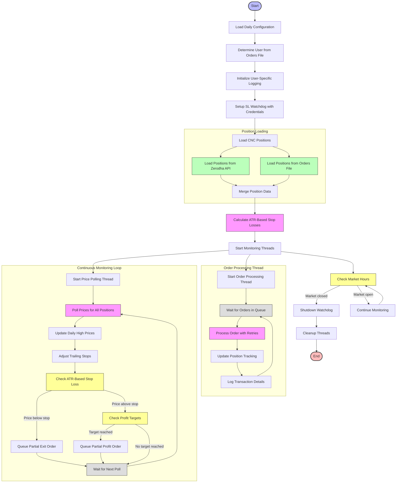

# SL Watchdog Process Flow

## SL_watchdog.py Flow Chart

## Key Logic Steps in SL_watchdog.py

1. **Configuration and Initialization**:
   - Loads configuration from Daily/config.ini
   - Determines user context from orders file or default user
   - Sets up user-specific logging in Daily/logs/USERNAME directory
   - Initializes Kite Connect client with user credentials

2. **Position Loading (Hybrid Approach)**:
   - **Primary Method**: Loads positions directly from Zerodha API
     - Fetches both open positions and holdings from Zerodha
     - Ensures all CNC positions are tracked regardless of origin
   - **Secondary Method**: Loads positions from specified orders file
     - Provides fallback for positions not yet reflected in broker API
     - Captures additional position details like original stop loss/target

3. **ATR-Based Stop Loss Calculation**:
   - Calculates 20-day ATR (Average True Range) for each position
   - Determines volatility category for each stock:
     - Low Volatility (ATR <2%): 1.0x ATR multiplier
     - Medium Volatility (ATR 2-4%): 1.5x ATR multiplier
     - High Volatility (ATR >4%): 2.0x ATR multiplier
   - Calculates initial stop loss based on ATR and volatility category

4. **True Trailing Stop Logic**:
   - Tracks daily high prices for all positions
   - Recalculates trailing stops based on new daily highs
   - Only adjusts stops in favorable direction (never moves downward)
   - Locks in profits while accommodating volatility

5. **Multi-Tranche Exit Strategy**:
   - Implements volatility-based partial exit strategy:
     - Low Volatility: 50% at stop loss, 30% at 2x ATR profit, 20% at 3x ATR profit
     - Medium Volatility: 40% at stop loss, 30% at 2.5x ATR profit, 30% at 4x ATR profit
     - High Volatility: 30% at stop loss, 30% at 3x ATR profit, 40% at 5x ATR profit
   - Manages quantity tracking for partial exits

6. **Order Execution with Retry Logic**:
   - Places orders with exponential backoff retry mechanism
   - Handles rate limiting errors from Zerodha API
   - Manages partial position updates after execution
   - Records detailed transaction information including P&L

7. **Market Hours Monitoring**:
   - Checks if market is closed (after 3:30 PM IST or weekends)
   - Automatically shuts down when market closes
   - Logs detailed portfolio summary at shutdown

## ATR-Based Volatility Categorization

| Volatility Category | ATR Percentage | ATR Multiplier | Stop Loss Calculation |
|---------------------|----------------|----------------|------------------------|
| Low Volatility      | <2%            | 1.0x           | Price - (1.0 * ATR)    |
| Medium Volatility   | 2-4%           | 1.5x           | Price - (1.5 * ATR)    |
| High Volatility     | >4%            | 2.0x           | Price - (2.0 * ATR)    |

## Multi-Tranche Exit Strategy

| Volatility Category | Stop Loss Tranche | Profit Target 1 | Profit Target 2 |
|---------------------|-------------------|-----------------|------------------|
| Low Volatility      | 50% of position   | 30% at 2x ATR   | 20% at 3x ATR    |
| Medium Volatility   | 40% of position   | 30% at 2.5x ATR | 30% at 4x ATR    |
| High Volatility     | 30% of position   | 30% at 3x ATR   | 40% at 5x ATR    |

## True Trailing Stop Mechanics

1. **Initial Stop Calculation**: Based on ATR multiplier and volatility category
2. **Daily High Tracking**: Monitors and records highest price reached each day
3. **Trailing Logic**: 
   - When price reaches new high: recalculate stop at (Daily High - ATR * Multiplier)
   - Only move stop upward, never downward
   - Continue trailing higher as price rises
4. **Breach Handling**: When price falls below trailing stop, trigger partial or full exit

## Execution Mode

- **Background Service**: Runs continuously until market close
- **Poll Interval**: Configurable price check interval (default: 45 seconds)
- **Verbose Mode**: Optional detailed logging for debugging
- **Orders File**: Optional specific orders file or automatic detection