# Common Issues and Solutions

## Known Issues and Fixes

```mermaid
flowchart TD
    subgraph "Issue Categories"
        StateSync[State Synchronization Issues]
        DuplicateOrders[Duplicate Order Issues]
        PositionTracking[Position Tracking Issues]
        APIErrors[API Error Issues]
    end
    
    subgraph "Common State Sync Issues"
        StateSync --> GhostPositions[Ghost Positions]
        StateSync --> InconsistentState[Inconsistent State]
        StateSync --> MissingPositions[Missing Positions]
        
        GhostPositions --- GhostFix[Fixed by 10-min inactivity reset & broker sync]
        InconsistentState --- StateFix[Fixed by state_manager.py reset logic]
        MissingPositions --- SyncFix[Fixed by broker sync in position_watchdog]
    end
    
    subgraph "Common Duplicate Order Issues"
        DuplicateOrders --> CloseReopen[Position Close/Reopen]
        DuplicateOrders --> MultipleEntries[Multiple Entries Same Ticker]
        DuplicateOrders --> ConflictingOrders[Conflicting Order Types]
        
        CloseReopen --- PlaceOrdersFix["Fixed by place_orders.py May 7th update"]
        MultipleEntries --- HourCooldown[Fixed by 1-hour cooldown between orders]
        ConflictingOrders --- OrderTypeFix[Fixed by product_type tracking]
    end
    
    subgraph "Position Tracking Issues"
        PositionTracking --> WrongType[Wrong Position Type]
        PositionTracking --> MissingStopLoss[Missing Stop Loss]
        PositionTracking --> StuckPositions[Stuck Positions]
        
        WrongType --- TypeFix[Fixed by explicit type in state]
        MissingStopLoss --- StopLossFix[Fixed by watchdog improvements]
        StuckPositions --- EODFix[Fixed by EOD Zerodha closure]
    end
    
    subgraph "API Error Issues"
        APIErrors --> RateLimiting[Rate Limiting]
        APIErrors --> AuthErrors[Authentication Errors]
        APIErrors --> OrderRejection[Order Rejection]
        
        RateLimiting --- DelayFix[Fixed by API request delays]
        AuthErrors --- TokenFix[Fixed by token refresh & retries]
        OrderRejection --- ValidationFix[Fixed by order validation]
    end
    
    classDef issue fill:#f9f,stroke:#333,stroke-width:1px;
    classDef fix fill:#bfb,stroke:#333,stroke-width:1px;
    classDef category fill:#bbf,stroke:#333,stroke-width:1px;
    
    class StateSync,DuplicateOrders,PositionTracking,APIErrors category;
    class GhostPositions,InconsistentState,MissingPositions,CloseReopen,MultipleEntries,ConflictingOrders,WrongType,MissingStopLoss,StuckPositions,RateLimiting,AuthErrors,OrderRejection issue;
    class GhostFix,StateFix,SyncFix,PlaceOrdersFix,HourCooldown,OrderTypeFix,TypeFix,StopLossFix,EODFix,DelayFix,TokenFix,ValidationFix fix;
```



## Common Issues and Solutions

### 1. Position Premature Closure Issue (May 7, 2025)

**Problem**: Positions like AGI and JAGSNPHARM were being closed prematurely when they disappeared from scan results, causing duplicate orders and position tracking confusion.

**Root Cause**: The place_orders.py script was designed to close positions when tickers dropped out of the latest scan results, creating confusion with position_watchdog.py which was still tracking these positions.

**Solution**: 
- Modified place_orders.py to ONLY place new orders and NOT close positions when tickers drop out of scan results
- Position closing now happens exclusively through:
  - position_watchdog.py (based on stop loss conditions)
  - EOD closure from Zerodha (for MIS positions)

**Code Fix**:
```python
# OLD BEHAVIOR - Would close positions when tickers dropped from scan
tickers_to_cover = {}
for ticker in short_previous_state:
    if ticker not in all_short_tickers:
        tickers_to_cover[ticker] = short_previous_state[ticker]["quantity"]

# NEW BEHAVIOR - Never closes positions based on scan results
tickers_to_cover = {}  # Empty dictionary - no positions to close
```

### 2. GapPercent KeyError Issue (May 7, 2025)

**Problem**: scan_market.py was generating errors like "Error processing TICKER: 0" due to KeyError(0) when accessing GapPercent values.

**Root Cause**: The code was trying to access GapPercent values in an unsafe way, leading to KeyError exceptions when the structure wasn't as expected.

**Solution**: Added safe extraction of gap percentage data with proper exception handling to prevent KeyError(0) during signal processing.

**Code Fix**:
```python
# OLD BEHAVIOR - Unsafe access
gap_percent = df_summary.get('GapPercent', [0])[0]

# NEW BEHAVIOR - Safe access with error handling
try:
    if 'GapPercent' in df_summary.columns:
        gap_percent = df_summary['GapPercent'].iloc[0] if len(df_summary) > 0 else 0
    else:
        gap_percent = 0
except Exception as e:
    logger.warning(f"Error extracting GapPercent: {e}, using 0 as default")
    gap_percent = 0
```

### 3. Position Type Confusion Issue

**Problem**: When positions are closed, position_watchdog sometimes gets confused about position types (e.g., treating a closed SHORT position as a new LONG position).

**Root Cause**: Incomplete state cleanup when positions are closed, leading to ambiguity in position type tracking.

**Solution**: 
- Added explicit product_type tracking in state management
- Improved broker state synchronization to properly remove closed positions
- Enhanced state reset logic to clear MIS positions on service restart

### 4. State Synchronization Issues

**Problem**: Inconsistent state between different components, leading to ghost positions and incorrect tracking.

**Root Cause**: Multiple components accessing and modifying state without proper synchronization.

**Solution**:
- Centralized all state management through the state_manager.py
- Implemented daily state reset logic to clear MIS positions
- Added 10-minute inactivity detection to handle service restarts
- Introduced broker state verification to remove ghost positions

## Best Practices for Avoiding Common Issues

1. **Clear Component Responsibilities**:
   - scan_market.py: ONLY generates signals
   - place_orders.py: ONLY places new orders
   - position_watchdog.py: ONLY monitors and closes positions
   - state_manager.py: ONLY manages state consistency

2. **State Management Guidelines**:
   - Always access state through state_manager.py
   - Verify positions with broker periodically
   - Implement timeouts for abandoned operations
   - Log all state transitions for auditing

3. **Order Placement Guidelines**:
   - Implement cooldown periods between orders (1 hour)
   - Verify position existence before placing orders
   - Include order validation checks
   - Maintain explicit position type tracking

4. **API Interaction Guidelines**:
   - Add delays between API calls to avoid rate limiting
   - Implement exponential backoff for retries
   - Handle token refresh automatically
   - Validate all API responses before processing