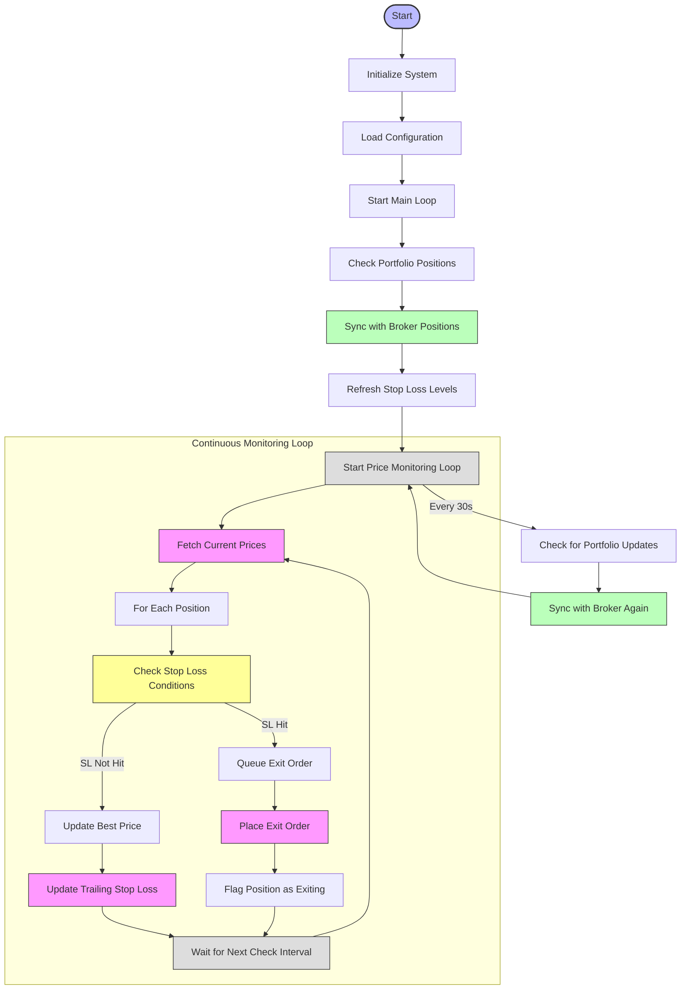

# Position Watchdog Process Flow

## position_watchdog.py Flow Chart

## Key Logic Steps in position_watchdog.py

1. **Position Synchronization**:
   - Fetches current positions from state manager
   - Verifies positions with broker positions (Zerodha)
   - Removes "ghost positions" that don't exist at broker
   - Ensures only real positions are monitored

2. **Stop Loss Initialization**:
   - Calculates initial stop loss levels for all positions
   - For LONG positions: Sets stop loss at candle low or ATR-based value
   - For SHORT positions: Sets stop loss at candle high or ATR-based value
   - Logs initial stop loss levels for all positions

3. **Continuous Monitoring**:
   - Fetches real-time prices at configured intervals
   - Compares current prices against stop loss levels
   - Executes stop loss orders when price thresholds are breached
   - Updates trailing stops as positions become profitable

4. **Trailing Stop Logic**:
   - For LONG positions: Updates stop loss upward as price increases
   - For SHORT positions: Updates stop loss downward as price decreases
   - Maintains percentage or ATR-based trailing distance
   - Never moves stops in unfavorable direction (locks in profits)

5. **Exit Order Execution**:
   - Places market orders when stop loss is triggered
   - Handles order confirmation and position state updates
   - Ensures only one exit order is placed per position
   - Records exit reasons and prices in state manager

## Position Tracking

- Monitors ALL positions registered in state manager
- Checks for portfolio updates every 30 seconds
- Synchronizes with broker state to remove closed positions
- Updates state manager to reflect current position status

## Important Notes

- Runs continuously as a background service
- Operates independently of place_orders.py
- Exclusively responsible for closing positions based on stop loss criteria
- Logs all stop loss updates and executions for audit purposes
- Does not place new entry orders - only handles exits