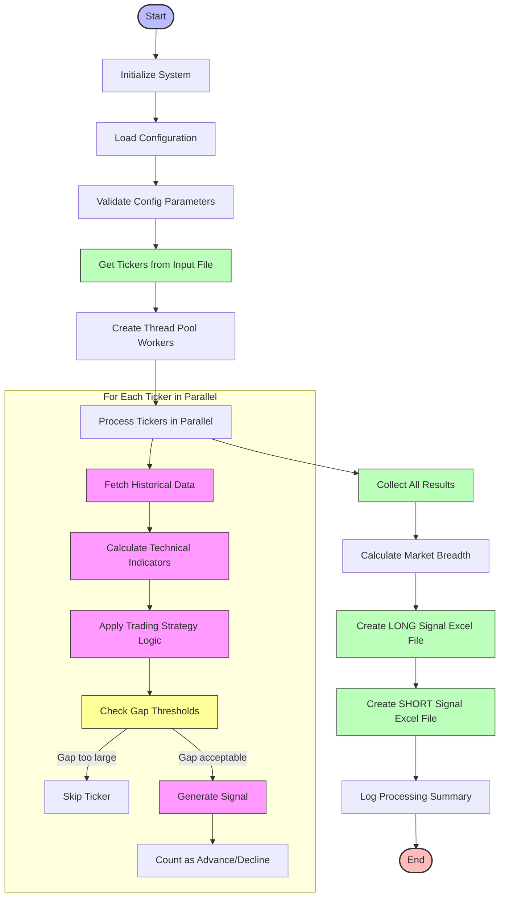

# Market Scanning Process Flow

## scan_market.py Flow Chart

## Key Logic Steps in scan_market.py

1. **Ticker Processing**:
   - Fetches historical price data for each ticker (daily or hourly timeframe)
   - Calculates technical indicators (EMA, ATR, KC Bands, etc.)
   - Checks for trading signals based on indicator values

2. **Signal Generation Rules**:
   - Long Signal: Price breaks above Keltner Channel upper band
   - Short Signal: Price breaks below Keltner Channel lower band
   - Volume spike confirmation (volume > volume_spike_threshold)

3. **Gap Filtering**:
   - For LONG signals: Skip if gap up exceeds gap_up_threshold (default 1.0%)
   - For SHORT signals: Skip if gap down exceeds gap_down_threshold (default -1.0%)

4. **Market Breadth Calculation**:
   - Count number of advancing vs declining stocks
   - Calculate A/D ratio for market direction analysis
   - Include in output files for use by place_orders.py

5. **Output Generation**:
   - Create signal files with nomenclature: "EMA_KV_F_Zerodha_{timeframe}_{date}_{time}.xlsx"
   - For long signals: EMA_KV_F_Zerodha_*.xlsx
   - For short signals: EMA_KV_F_Short_Zerodha_*.xlsx
   - Include summary sheet with market breadth information

## Important Notes

- Tickers are processed concurrently using a thread pool
- API rate limiting is managed by adding delays between API calls
- The script performs gap filtering to avoid chasing stocks that have already moved significantly
- Results are stored in Excel files in the data directory for use by place_orders.py