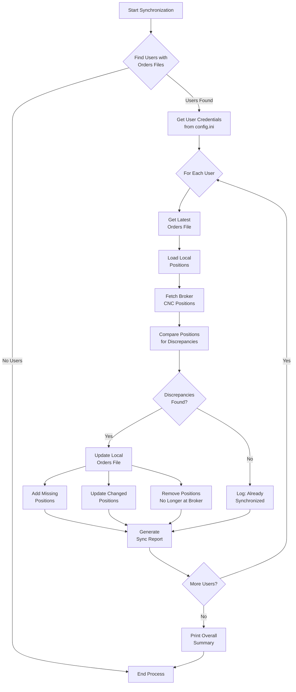

# Zerodha CNC Positions Synchronization Flow

This document describes the synchronization flow between Zerodha broker's CNC positions and the local orders tracking system. This process ensures consistency between the broker's server state and the local trading system.

## Overview

The `synch_zerodha_cnc_positions.py` script synchronizes CNC (Carry & Forward / Delivery) positions from Zerodha broker to local order files stored in the `Daily/Current_Orders/{USER}` directories. This ensures that the local system accurately tracks positions that exist on the broker's side, preventing errors like "insufficient holdings" or "ghost positions".

## Scheduled Execution

The script is scheduled to run automatically through a LaunchAgent:

- **Frequency**: Every 15 minutes during market hours
- **Schedule**: Monday to Friday, 9:15 AM to 3:30 PM IST
- **LaunchAgent**: `com.india-ts.synch_zerodha_local.plist`
- **Execution Times**: 25 runs per trading day (9:15, 9:30, 9:45... through 3:30)

## Synchronization Flow Diagram



## Detailed Process

1. **User Detection**:
   - Auto-detects all users with recent orders files in `Daily/Current_Orders/{USER}`
   - Checks if each user has valid credentials in `config.ini`

2. **Loading Local Data**:
   - For each user, finds the most recent orders file
   - Extracts CNC positions from the orders file

3. **Broker Data Retrieval**:
   - Uses user credentials to connect to Zerodha API
   - Fetches current CNC positions and holdings

4. **Position Comparison**:
   - Compares local positions with broker positions
   - Identifies discrepancies (missing, extra, or changed positions)

5. **File Updates**:
   - Adds positions found at broker but missing locally
   - Updates positions with different quantities or prices
   - Removes positions no longer present at broker

6. **Multi-User Support**:
   - Processes all users with valid credentials and order files
   - Each user's synchronization is independent

## Discrepancy Handling

The system detects four types of discrepancies:

1. **Missing Broker**: Position exists locally but not at broker
   - Action: Remove from local file
   - Common cause: Position was sold on broker

2. **Missing Local**: Position exists at broker but not locally
   - Action: Add to local file
   - Common cause: Position was bought outside the system

3. **Quantity Mismatch**: Different quantity between local and broker
   - Action: Update local quantity to match broker
   - Common cause: Partial sell orders or splits

4. **Price Mismatch**: Different average price between local and broker
   - Action: Update local price to match broker
   - Common cause: Averaging down/up with additional buys

## Integration with Watchdog

The synchronization process helps the stop-loss watchdog by:

1. Ensuring it tracks only positions that actually exist at the broker
2. Preventing attempts to close already-closed positions
3. Adding positions bought through other means to tracking
4. Handling position adjustments (like partial sells)

## Command-Line Usage

The script can also be run manually with various options:

```bash
# Sync all users (default)
python synch_zerodha_cnc_positions.py

# Sync a specific user only
python synch_zerodha_cnc_positions.py --sync-user Som

# Dry run (show changes without making them)
python synch_zerodha_cnc_positions.py --dry-run

# Save detailed output to JSON file
python synch_zerodha_cnc_positions.py --json-output sync_report.json
```

## Scheduler Management

The LaunchAgent can be managed with these commands:

```bash
# Start the scheduler
launchctl load ~/Library/LaunchAgents/com.india-ts.synch_zerodha_local.plist

# Stop the scheduler
launchctl unload ~/Library/LaunchAgents/com.india-ts.synch_zerodha_local.plist

# Run once immediately (for testing)
launchctl start com.india-ts.synch_zerodha_local
```

## Logs

All synchronization activities are logged to:
`/Users/maverick/PycharmProjects/India-TS/Daily/logs/synch_zerodha_cnc_positions.log`