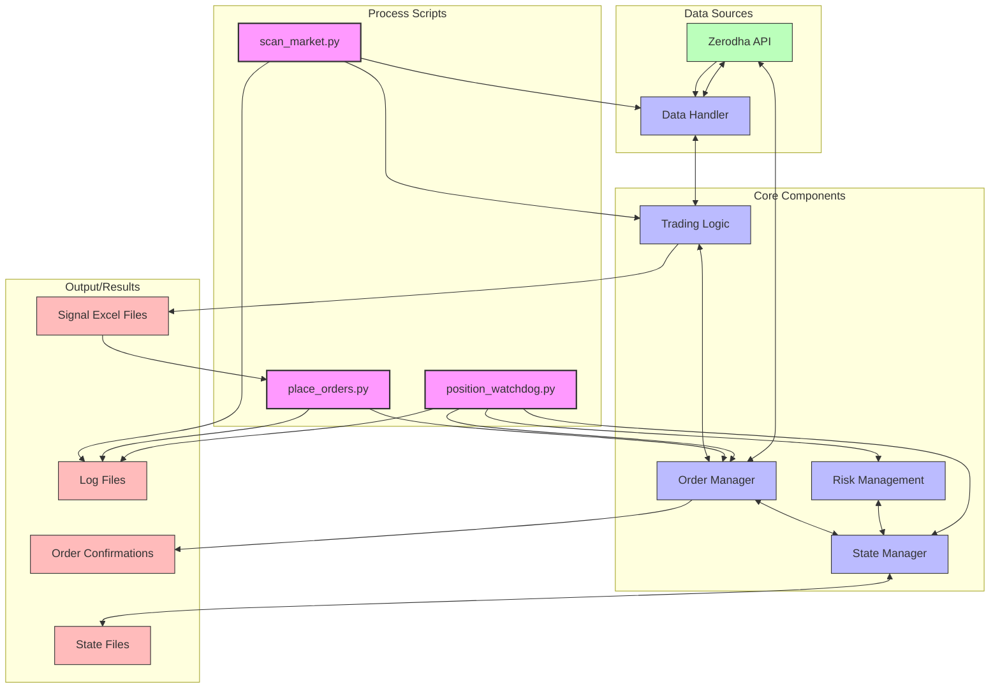

# Trading System Overview

## High-Level System Architecture

## Key Components

1. **Data Handler (data_handler.py)**
   - Handles all data fetching operations from Zerodha API
   - Caches instrument data and stock prices
   - Responsible for reading signal files and historical data

2. **Trading Logic (trading_logic.py)**
   - Contains core trading strategies and signal generation logic
   - Analyzes market data to generate trading signals
   - Performs market breadth analysis

3. **Order Manager (order_manager.py)**
   - Handles order placement, modification, and cancellation
   - Manages order state and communicates with Zerodha API
   - Records order confirmations and position tracking

4. **State Manager (state_manager.py)**
   - Central repository for all trading state
   - Manages positions, GTT orders, and daily ticker lists
   - Handles state persistence and synchronization

5. **Risk Management (integrated in position_watchdog.py)**
   - Risk management now integrated into position_watchdog.py
   - Implements risk controls and position sizing
   - Manages stop losses and target prices
   - Ensures compliance with risk parameters

## Process Sequence

1. **Market Scanning (scan_market.py)**
   - Runs on a schedule (hourly)
   - Scans the market for trading opportunities
   - Generates signal files with trading candidates

2. **Order Placement (place_orders.py)**
   - Runs on a schedule (every 10 minutes)
   - Reads signal files generated by scan_market.py
   - Places new orders based on signals
   - Does NOT close positions when tickers drop from signals

3. **Position Monitoring (position_watchdog.py)**
   - Runs continuously
   - Monitors open positions against stop loss levels
   - Places stop loss orders when thresholds are breached
   - Updates trailing stops as positions become profitable

