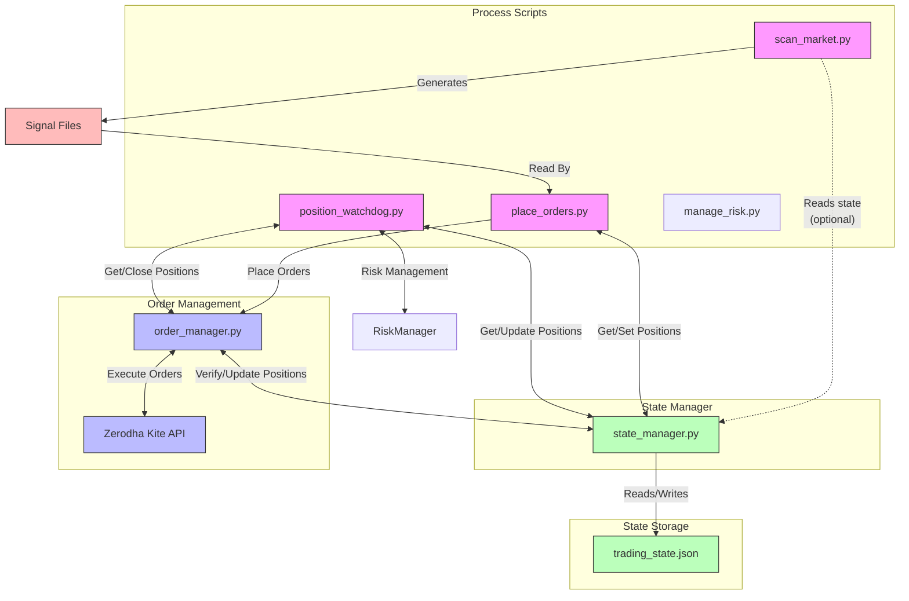
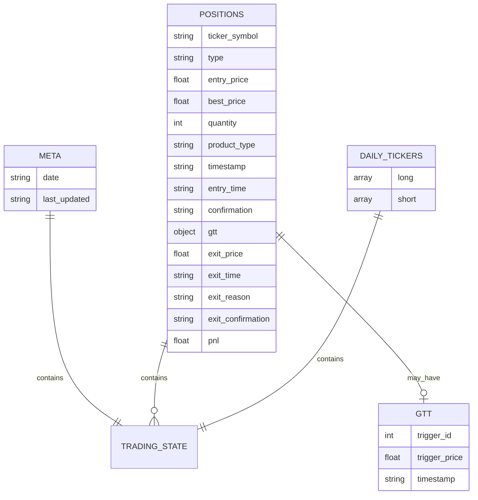

# System State Management Flow

## State Interactions Between Components

## State Data Structure

## Key State Management Functions

1. **State Initialization**:
   - State manager loads state from trading_state.json on startup
   - Performs new trading day reset checks based on date
   - Resets MIS positions after service restarts (>10 min inactive)

2. **Position Management**:
   - add_position(): Adds or updates a position with full details
   - remove_position(): Removes position or records exit details
   - update_position_quantity(): Updates quantity of existing position
   - update_best_price(): Updates best price for trailing stops
   - get_position(), get_all_positions(), get_positions_by_type()

3. **GTT Management**:
   - add_gtt(): Adds GTT information to a position
   - remove_gtt(): Removes GTT data
   - get_gtt(), get_all_gtts()

4. **Daily Ticker Management**:
   - add_daily_ticker(): Marks ticker as traded today
   - is_ticker_traded_today(): Checks if ticker was traded today
   - get_daily_tickers()

5. **Day Reset Logic**:
   - reset_for_new_trading_day(): Clears MIS positions, preserves CNC
   - Updates meta information with new date
   - Can be forced even on same day

## State Synchronization

1. **place_orders.py**:
   - Reads signal files to determine new positions
   - Adds new positions to state via state_manager
   - Uses state to avoid duplicate trades

2. **position_watchdog.py**:
   - Continuously monitors positions in state
   - Updates stop loss levels and best prices
   - Removes positions when stop loss is triggered

3. **Broker Synchronization**:
   - Periodically verifies positions with broker
   - Ensures state matches actual broker positions
   - Removes "ghost" positions not at broker

## Important Notes

- All components interact through the state_manager
- State is persisted in trading_state.json
- New trading day triggers state reset for MIS positions
- CNC positions are preserved across days
- State changes are logged with timestamps