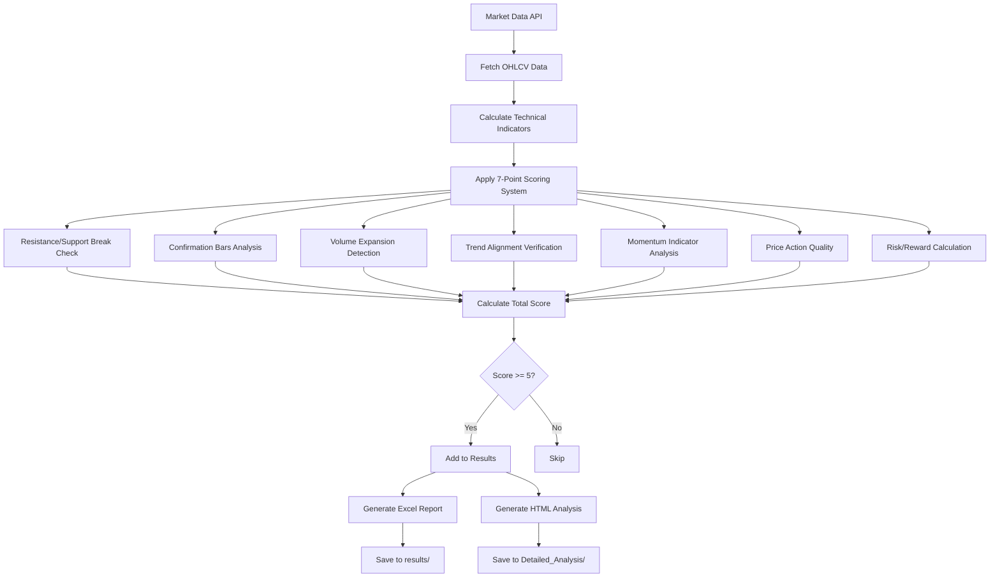
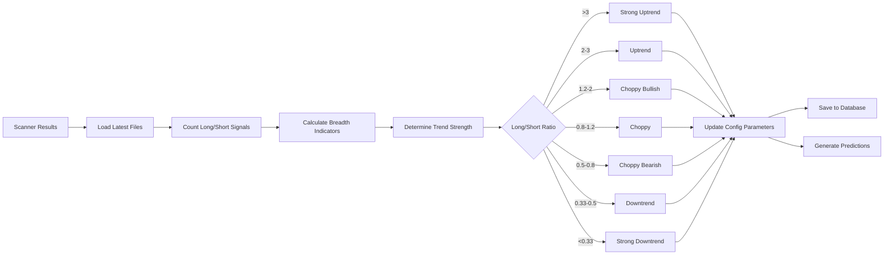
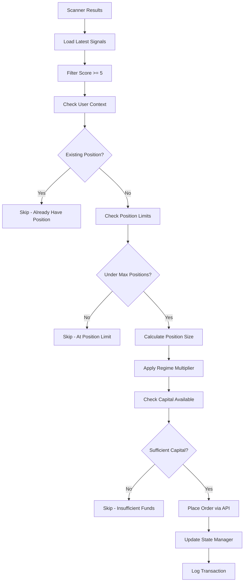
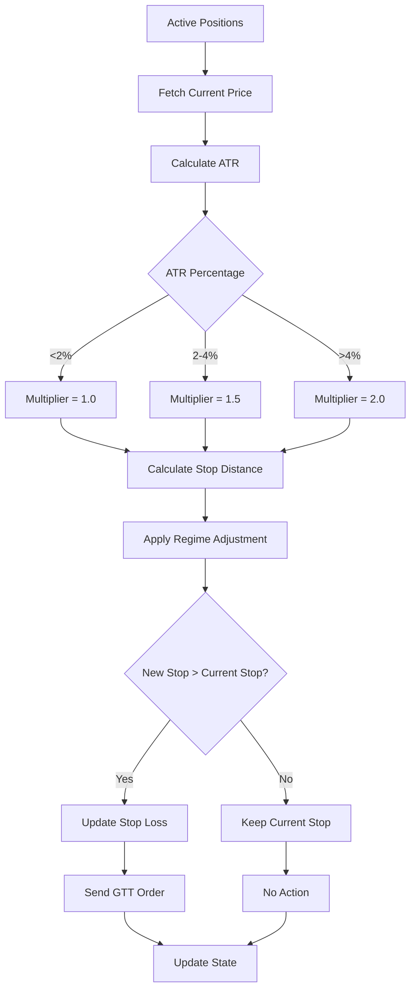
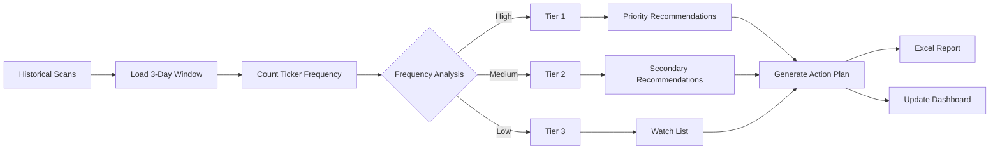

# India TS 3.0 - Component Diagrams and Logic Flow

## 1. Scanner System Architecture

### Reversal Scanner Logic Flow


### Scanner Dependencies
```
┌─────────────────────────────────────────────────────┐
│                Scanner Components                    │
├─────────────────────────────────────────────────────┤
│                                                     │
│  ┌─────────────────┐      ┌─────────────────┐    │
│  │ KiteConnect API │      │ Sector Database │    │
│  └────────┬────────┘      └────────┬────────┘    │
│           │                         │              │
│           └────────┬────────────────┘              │
│                    ↓                               │
│  ┌─────────────────────────────────────────┐      │
│  │         Base Scanner Class              │      │
│  │  • Data fetching                        │      │
│  │  • Indicator calculation                │      │
│  │  • Score computation                    │      │
│  └─────────────────────────────────────────┘      │
│                    ↓                               │
│  ┌──────────────────┴──────────────────┐          │
│  ↓                                      ↓          │
│ ┌───────────────────┐  ┌───────────────────┐     │
│ │ Long Reversal     │  │ Short Reversal    │     │
│ │ Scanner           │  │ Scanner           │     │
│ └───────────────────┘  └───────────────────┘     │
│                                                    │
└─────────────────────────────────────────────────────┘
```

## 2. Market Regime Analysis System

### Regime Detection Flow


### Market Regime Learning System
```
┌─────────────────────────────────────────────────────┐
│              ML Learning Pipeline                    │
├─────────────────────────────────────────────────────┤
│                                                     │
│  Historical Data Collection                         │
│  ┌─────────────────────────────────────────┐      │
│  │ Scanner Results → Features Extraction    │      │
│  └─────────────────────────────────────────┘      │
│                    ↓                               │
│  Feature Engineering                               │
│  ┌─────────────────────────────────────────┐      │
│  │ • Signal counts                         │      │
│  │ • Breadth indicators                    │      │
│  │ • Momentum scores                       │      │
│  │ • Volatility metrics                    │      │
│  └─────────────────────────────────────────┘      │
│                    ↓                               │
│  Model Training (RandomForest)                     │
│  ┌─────────────────────────────────────────┐      │
│  │ Input: Features → Output: Regime        │      │
│  └─────────────────────────────────────────┘      │
│                    ↓                               │
│  Prediction & Validation                           │
│  ┌─────────────────────────────────────────┐      │
│  │ Make Prediction → Wait 30 min → Verify  │      │
│  └─────────────────────────────────────────┘      │
│                    ↓                               │
│  Model Update & Storage                            │
│  ┌─────────────────────────────────────────┐      │
│  │ Update weights → Save model → Track     │      │
│  │ performance metrics                     │      │
│  └─────────────────────────────────────────┘      │
│                                                     │
└─────────────────────────────────────────────────────┘
```

## 3. Order Management System

### Order Placement Logic


### Multi-User Context Management
```
┌─────────────────────────────────────────────────────┐
│             UserContextManager                       │
├─────────────────────────────────────────────────────┤
│                                                     │
│  User Authentication                                │
│  ┌─────────────────────────────────────────┐      │
│  │ Load credentials from config.ini         │      │
│  │ Create KiteConnect instance per user    │      │
│  └─────────────────────────────────────────┘      │
│                    ↓                               │
│  State Isolation                                   │
│  ┌─────────────────────────────────────────┐      │
│  │ User: Sai                               │      │
│  │ • Positions: [...]                      │      │
│  │ • Orders: [...]                         │      │
│  │ • Capital: XXX                          │      │
│  └─────────────────────────────────────────┘      │
│  ┌─────────────────────────────────────────┐      │
│  │ User: Ravi                              │      │
│  │ • Positions: [...]                      │      │
│  │ • Orders: [...]                         │      │
│  │ • Capital: XXX                          │      │
│  └─────────────────────────────────────────┘      │
│                                                     │
│  Unified State File                                │
│  ┌─────────────────────────────────────────┐      │
│  │ trading_state.json                      │      │
│  │ {                                       │      │
│  │   "Sai": {...},                         │      │
│  │   "Ravi": {...},                        │      │
│  │   "Som": {...}                          │      │
│  │ }                                       │      │
│  └─────────────────────────────────────────┘      │
│                                                     │
└─────────────────────────────────────────────────────┘
```

## 4. Risk Management System

### Stop Loss Management Flow


### Portfolio Heat Calculation
```
┌─────────────────────────────────────────────────────┐
│            Portfolio Risk Monitor                    │
├─────────────────────────────────────────────────────┤
│                                                     │
│  For Each Position:                                 │
│  ┌─────────────────────────────────────────┐      │
│  │ Risk = (Entry - Stop) × Quantity         │      │
│  │ Risk % = Risk / Portfolio Value          │      │
│  └─────────────────────────────────────────┘      │
│                    ↓                               │
│  Aggregate Portfolio Heat                          │
│  ┌─────────────────────────────────────────┐      │
│  │ Total Heat = Σ(Position Risk %)         │      │
│  └─────────────────────────────────────────┘      │
│                    ↓                               │
│  Risk Controls                                     │
│  ┌─────────────────────────────────────────┐      │
│  │ IF Total Heat > 5%:                     │      │
│  │   • Block new positions                 │      │
│  │   • Tighten stops on existing           │      │
│  │   • Alert user                          │      │
│  └─────────────────────────────────────────┘      │
│                                                     │
└─────────────────────────────────────────────────────┘
```

## 5. Analysis and Reporting System

### Action Plan Generation Flow


### Performance Analytics Pipeline
```
┌─────────────────────────────────────────────────────┐
│           Performance Tracking System                │
├─────────────────────────────────────────────────────┤
│                                                     │
│  Real-time Metrics                                 │
│  ┌─────────────────────────────────────────┐      │
│  │ • P&L per position                      │      │
│  │ • Win/Loss ratio                        │      │
│  │ • Average hold time                     │      │
│  │ • Regime performance                    │      │
│  └─────────────────────────────────────────┘      │
│                    ↓                               │
│  Daily Aggregation                                 │
│  ┌─────────────────────────────────────────┐      │
│  │ • Daily P&L                             │      │
│  │ • Sharpe ratio                          │      │
│  │ • Max drawdown                          │      │
│  │ • Sector performance                    │      │
│  └─────────────────────────────────────────┘      │
│                    ↓                               │
│  Reports & Dashboards                              │
│  ┌─────────────────────────────────────────┐      │
│  │ • Excel summaries                       │      │
│  │ • Web dashboard                         │      │
│  │ • Email alerts                          │      │
│  └─────────────────────────────────────────┘      │
│                                                     │
└─────────────────────────────────────────────────────┘
```

## 6. Scheduled Job Architecture

### Daily Schedule Timeline
```
Time    | Job                          | Duration | Dependencies
--------|------------------------------|----------|------------------
08:30   | Daily Action Plan           | 5 min    | Historical data
08:45   | Consolidated Score          | 5 min    | Action Plan
09:00   | Long Reversal Scanner       | 3 min    | Market data
09:00   | Short Reversal Scanner      | 3 min    | Market data
09:10   | Market Regime Analysis      | 2 min    | Scanner results
09:20   | Synch Zerodha Local        | 1 min    | API access
09:30   | Long Reversal Scanner       | 3 min    | Market data
09:30   | Short Reversal Scanner      | 3 min    | Market data
09:35   | Outcome Resolver            | 2 min    | Predictions
09:40   | Market Regime Analysis      | 2 min    | Scanner results
09:50   | Synch Zerodha Local        | 1 min    | API access
...     | (Pattern repeats)           |          |
15:00   | Portfolio Prune            | 5 min    | Position data
16:15   | Market Regime Daily Metrics | 5 min    | Day's data
```

### Job Dependency Graph
```
┌─────────────────┐
│ Daily Action    │
│ Plan (8:30)     │
└────────┬────────┘
         ↓
┌─────────────────┐
│ Consolidated    │
│ Score (8:45)    │
└────────┬────────┘
         ↓
┌─────────────────┐     ┌─────────────────┐
│ Long Reversal   │     │ Short Reversal  │
│ Scanner (:00/:30)│     │ Scanner (:00/:30)│
└────────┬────────┘     └────────┬────────┘
         └──────────┬────────────┘
                    ↓
         ┌─────────────────┐
         │ Market Regime   │
         │ Analysis (:10/:40)│
         └────────┬────────┘
                  ↓
         ┌─────────────────┐
         │ Place Orders    │
         │ (Manual/Auto)   │
         └────────┬────────┘
                  ↓
         ┌─────────────────┐
         │ SL Watchdog     │
         │ (Continuous)    │
         └─────────────────┘
```

## 7. Database Schema

### SQLite Database Structure
```sql
-- regime_learning.db schema

-- Predictions table
CREATE TABLE regime_predictions (
    id INTEGER PRIMARY KEY,
    timestamp DATETIME,
    predicted_regime TEXT,
    confidence REAL,
    features TEXT,  -- JSON
    model_version TEXT,
    actual_regime TEXT,
    outcome_timestamp DATETIME,
    is_correct BOOLEAN
);

-- Historical regimes
CREATE TABLE predictions (
    id INTEGER PRIMARY KEY,
    timestamp DATETIME,
    regime TEXT,
    confidence REAL,
    market_score REAL,
    trend_score REAL,
    momentum_score REAL,
    volatility_score REAL,
    breadth_score REAL,
    indicators TEXT,  -- JSON
    reasoning TEXT    -- JSON
);

-- Regime transitions
CREATE TABLE regime_changes (
    id INTEGER PRIMARY KEY,
    timestamp DATETIME,
    from_regime TEXT,
    to_regime TEXT,
    confidence REAL,
    trigger_indicators TEXT,  -- JSON
    market_conditions TEXT    -- JSON
);

-- Model performance
CREATE TABLE model_performance (
    id INTEGER PRIMARY KEY,
    date DATE,
    accuracy REAL,
    precision_json TEXT,
    recall_json TEXT,
    total_predictions INTEGER,
    correct_predictions INTEGER
);
```

## 8. Configuration Management

### Dynamic Configuration Flow
```
┌─────────────────────────────────────────────────────┐
│              Configuration System                    │
├─────────────────────────────────────────────────────┤
│                                                     │
│  Static Configuration (config.ini)                  │
│  ┌─────────────────────────────────────────┐      │
│  │ • User credentials                       │      │
│  │ • Base parameters                       │      │
│  │ • System settings                       │      │
│  └─────────────────────────────────────────┘      │
│                    ↓                               │
│  Dynamic Regime Adjustments                        │
│  ┌─────────────────────────────────────────┐      │
│  │ Market Regime → Parameter Updates       │      │
│  │ • position_size_multiplier             │      │
│  │ • stop_loss_multiplier                 │      │
│  │ • confidence_threshold                  │      │
│  └─────────────────────────────────────────┘      │
│                    ↓                               │
│  Runtime State (trading_state.json)                │
│  ┌─────────────────────────────────────────┐      │
│  │ • Active positions                      │      │
│  │ • Pending orders                        │      │
│  │ • User balances                        │      │
│  └─────────────────────────────────────────┘      │
│                                                     │
└─────────────────────────────────────────────────────┘
```

---

*These diagrams represent the core logic and dependencies of India TS 3.0 components. Each component is designed for modularity, scalability, and fault tolerance.*