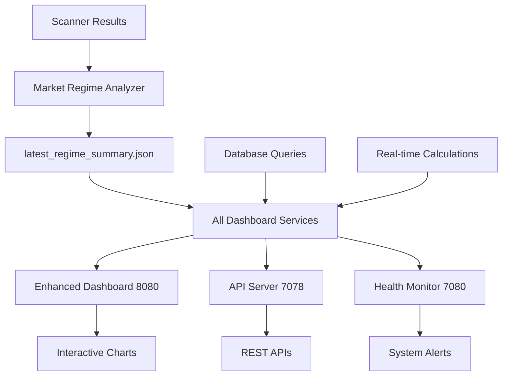

# India TS 3.0 - Dashboard and Monitoring Architecture

## Market Regime Dashboard

### Dashboard Components
```
┌─────────────────────────────────────────────────────────────┐
│                 Market Regime Dashboard                      │
├─────────────────────────────────────────────────────────────┤
│                                                             │
│  ┌─────────────────────────┐  ┌──────────────────────┐    │
│  │   Current Regime Box     │  │  Prediction Box      │    │
│  │  ┌───────────────────┐  │  │  ┌────────────────┐ │    │
│  │  │  CHOPPY BULLISH   │  │  │  │ Next: UPTREND  │ │    │
│  │  │  Confidence: 75%  │  │  │  │ Conf: 68%      │ │    │
│  │  └───────────────────┘  │  │  └────────────────┘ │    │
│  └─────────────────────────┘  └──────────────────────┘    │
│                                                             │
│  ┌─────────────────────────────────────────────────────┐  │
│  │              Scanner Breadth Chart                   │  │
│  │  Long: ████████████████ 25                         │  │
│  │  Short: ████████ 12                                │  │
│  │  Ratio: 2.08                                        │  │
│  └─────────────────────────────────────────────────────┘  │
│                                                             │
│  ┌─────────────────────────────────────────────────────┐  │
│  │           Learning System Metrics                    │  │
│  │  Model Accuracy: 72%                                │  │
│  │  Predictions Today: 15                              │  │
│  │  Resolved: 12                                       │  │
│  │  Pending: 3                                         │  │
│  └─────────────────────────────────────────────────────┘  │
│                                                             │
│  ┌─────────────────────────────────────────────────────┐  │
│  │             Recent Predictions Table                 │  │
│  ├─────┬──────────┬───────────┬──────────┬────────────┤  │
│  │Time │Predicted │Actual     │Correct   │Confidence  │  │
│  ├─────┼──────────┼───────────┼──────────┼────────────┤  │
│  │15:10│Choppy    │Choppy     │✓         │82%         │  │
│  │14:40│Uptrend   │Choppy     │✗         │65%         │  │
│  │14:10│Choppy    │Choppy     │✓         │78%         │  │
│  └─────┴──────────┴───────────┴──────────┴────────────┘  │
│                                                             │
└─────────────────────────────────────────────────────────────┘
```

### Current Dashboard Endpoints (July 2025)

#### Enhanced Dashboard (Port 8080)
- **URL**: http://localhost:8080
- **Purpose**: Interactive trading dashboard with real-time charts
- **Features**: 
  - Live market regime display
  - Historical trend charts
  - Position recommendations
  - Model performance metrics
- **API**: `/api/current_analysis` - Unified data from latest_regime_summary.json

#### API Dashboard Server (Port 7078)  
- **URL**: http://localhost:7078
- **Purpose**: Data backend and API server
- **APIs**:
  - `/api/latest` - Complete regime analysis data
  - `/api/status` - System health status
- **Use Case**: External integrations, programmatic access

#### Health Dashboard (Port 7080)
- **URL**: http://localhost:7080  
- **Purpose**: System monitoring and health checks
- **Features**: Component status, alerts, system diagnostics

### Dashboard Data Flow - Updated Architecture


### Dashboard Technical Stack - Updated July 2025
```
┌─────────────────────────────────────────────────────┐
│              Dashboard Architecture                  │
├─────────────────────────────────────────────────────┤
│                                                     │
│  Multiple Dashboard Services                        │
│  ┌─────────────────────────────────────────┐      │
│  │ • Enhanced Dashboard (Port 8080)        │      │
│  │   - dashboard_enhanced.py               │      │
│  │   - Interactive charts & real-time UI  │      │
│  │                                         │      │
│  │ • API Dashboard Server (Port 7078)     │      │
│  │   - dashboard_server.py                 │      │
│  │   - RESTful API endpoints              │      │
│  │                                         │      │
│  │ • Health Dashboard (Port 7080)         │      │
│  │   - dashboard_health_check.py          │      │
│  │   - System monitoring                  │      │
│  └─────────────────────────────────────────┘      │
│                    ↓                               │
│  Unified Data Source (Single Source of Truth)     │
│  ┌─────────────────────────────────────────┐      │
│  │ • latest_regime_summary.json           │      │
│  │ • regime_learning.db                    │      │
│  │ • Latest scanner results                │      │
│  └─────────────────────────────────────────┘      │
│                    ↓                               │
│  Frontend (HTML/CSS/JS)                            │
│  ┌─────────────────────────────────────────┐      │
│  │ • Bootstrap for responsive design       │      │
│  │ • Chart.js for visualizations           │      │
│  │ • jQuery for dynamic updates            │      │
│  └─────────────────────────────────────────┘      │
│                                                     │
└─────────────────────────────────────────────────────┘
```

## Monitoring and Alerting System

### System Health Monitoring
```
┌─────────────────────────────────────────────────────┐
│            Health Check Dashboard                    │
├─────────────────────────────────────────────────────┤
│                                                     │
│  Service Status                                     │
│  ┌─────────────────────────────────────────┐      │
│  │ Scanner (Long)    : ● Running           │      │
│  │ Scanner (Short)   : ● Running           │      │
│  │ Market Regime     : ● Running           │      │
│  │ SL Watchdog       : ● Running           │      │
│  │ Dashboard         : ● Active            │      │
│  └─────────────────────────────────────────┘      │
│                                                     │
│  Recent Errors                                      │
│  ┌─────────────────────────────────────────┐      │
│  │ [15:23] API rate limit warning          │      │
│  │ [14:50] Scanner timeout (recovered)     │      │
│  │ [09:15] Database lock (resolved)        │      │
│  └─────────────────────────────────────────┘      │
│                                                     │
│  Performance Metrics                                │
│  ┌─────────────────────────────────────────┐      │
│  │ Avg Scanner Time : 2.3s                 │      │
│  │ API Calls/Hour   : 245/300              │      │
│  │ DB Size          : 125MB                │      │
│  │ CPU Usage        : 23%                  │      │
│  └─────────────────────────────────────────┘      │
│                                                     │
└─────────────────────────────────────────────────────┘
```

### Log Aggregation Architecture
```
┌─────────────────────────────────────────────────────┐
│              Log Management System                   │
├─────────────────────────────────────────────────────┤
│                                                     │
│  Log Sources                                        │
│  ┌─────────────────────────────────────────┐      │
│  │ Daily/logs/                             │      │
│  │ • long_reversal_daily.log               │      │
│  │ • short_reversal_daily.log              │      │
│  │ • market_regime_analysis.log            │      │
│  │ • place_orders_daily.log                │      │
│  │ • sl_watchdog.log                       │      │
│  └─────────────────────────────────────────┘      │
│                    ↓                               │
│  Log Aggregation                                    │
│  ┌─────────────────────────────────────────┐      │
│  │ • Centralized log viewer                │      │
│  │ • Real-time tail functionality          │      │
│  │ • Search and filter capabilities        │      │
│  │ • Error highlighting                    │      │
│  └─────────────────────────────────────────┘      │
│                    ↓                               │
│  Alerting Rules                                     │
│  ┌─────────────────────────────────────────┐      │
│  │ • Scanner failures                      │      │
│  │ • API errors                            │      │
│  │ • Position limit breaches               │      │
│  │ • Stop loss execution failures          │      │
│  └─────────────────────────────────────────┘      │
│                                                     │
└─────────────────────────────────────────────────────┘
```

## Performance Monitoring

### Key Performance Indicators (KPIs)
```
┌─────────────────────────────────────────────────────┐
│                  KPI Dashboard                       │
├─────────────────────────────────────────────────────┤
│                                                     │
│  Trading Performance                                │
│  ┌─────────────────────────────────────────┐      │
│  │ Daily P&L         : +2.3%               │      │
│  │ Win Rate          : 68%                 │      │
│  │ Avg Win/Loss      : 1.8                 │      │
│  │ Sharpe Ratio      : 1.45                │      │
│  │ Max Drawdown      : -4.2%               │      │
│  └─────────────────────────────────────────┘      │
│                                                     │
│  Regime Performance                                 │
│  ┌─────────────────────────────────────────┐      │
│  │ Strong Uptrend    : +5.2% (12 trades)   │      │
│  │ Uptrend           : +3.1% (25 trades)   │      │
│  │ Choppy            : +0.8% (45 trades)   │      │
│  │ Downtrend         : -1.2% (18 trades)   │      │
│  └─────────────────────────────────────────┘      │
│                                                     │
│  Scanner Effectiveness                              │
│  ┌─────────────────────────────────────────┐      │
│  │ Long Scanner Hit Rate  : 72%            │      │
│  │ Short Scanner Hit Rate : 65%            │      │
│  │ Avg Score of Winners   : 6.2/7          │      │
│  │ Avg Score of Losers    : 5.1/7          │      │
│  └─────────────────────────────────────────┘      │
│                                                     │
└─────────────────────────────────────────────────────┘
```

### System Resource Monitoring
```
┌─────────────────────────────────────────────────────┐
│            Resource Usage Monitor                    │
├─────────────────────────────────────────────────────┤
│                                                     │
│  CPU Usage Timeline                                 │
│  ┌─────────────────────────────────────────┐      │
│  │     100%│                                │      │
│  │      75%│    ▂▃▄▂                        │      │
│  │      50%│ ▂▄▆████▆▄▂  ▂▄▆████▆▄▂       │      │
│  │      25%│▄████████████████████████▄     │      │
│  │       0%└─────────────────────────       │      │
│  │         9AM    10AM    11AM    12PM      │      │
│  └─────────────────────────────────────────┘      │
│                                                     │
│  Memory Usage                                       │
│  ┌─────────────────────────────────────────┐      │
│  │ Scanner Processes  : 250MB               │      │
│  │ Market Regime      : 180MB               │      │
│  │ Dashboard          : 120MB               │      │
│  │ Database           : 125MB               │      │
│  │ Total              : 675MB / 4GB         │      │
│  └─────────────────────────────────────────┘      │
│                                                     │
│  API Usage                                          │
│  ┌─────────────────────────────────────────┐      │
│  │ Kite API Calls    : 2,450 / 3,000       │      │
│  │ Rate Limit Buffer : 550 calls            │      │
│  │ Peak Usage Time   : 9:30 AM              │      │
│  └─────────────────────────────────────────┘      │
│                                                     │
└─────────────────────────────────────────────────────┘
```

## Alert Configuration

### Alert Rules and Notifications
```yaml
# Alert Configuration (alerts.yaml)

scanner_alerts:
  - name: "Scanner Failure"
    condition: "No results for > 35 minutes"
    severity: "HIGH"
    action: "Email + Dashboard Alert"
    
  - name: "Low Signal Count"
    condition: "Total signals < 5"
    severity: "MEDIUM"
    action: "Dashboard Warning"

trading_alerts:
  - name: "Position Limit Reached"
    condition: "Positions >= max_positions"
    severity: "MEDIUM"
    action: "Block new orders + Alert"
    
  - name: "Stop Loss Failed"
    condition: "GTT order rejection"
    severity: "HIGH"
    action: "Email + SMS + Dashboard"

system_alerts:
  - name: "High CPU Usage"
    condition: "CPU > 80% for 5 minutes"
    severity: "MEDIUM"
    action: "Email + Throttle jobs"
    
  - name: "Database Lock"
    condition: "Lock timeout > 30s"
    severity: "HIGH"
    action: "Email + Auto-recovery"

market_regime_alerts:
  - name: "Regime Change"
    condition: "New regime != Previous"
    severity: "INFO"
    action: "Dashboard + Log"
    
  - name: "Low Model Confidence"
    condition: "Confidence < 50%"
    severity: "MEDIUM"
    action: "Reduce position sizes"
```

### Notification Channels
```
┌─────────────────────────────────────────────────────┐
│           Notification System                        │
├─────────────────────────────────────────────────────┤
│                                                     │
│  Email Notifications                                │
│  ┌─────────────────────────────────────────┐      │
│  │ • Critical alerts                       │      │
│  │ • Daily summaries                       │      │
│  │ • Weekly reports                        │      │
│  └─────────────────────────────────────────┘      │
│                                                     │
│  Dashboard Alerts                                   │
│  ┌─────────────────────────────────────────┐      │
│  │ • Real-time popups                      │      │
│  │ • Alert history                         │      │
│  │ • Color-coded severity                  │      │
│  └─────────────────────────────────────────┘      │
│                                                     │
│  Log File Alerts                                    │
│  ┌─────────────────────────────────────────┐      │
│  │ • Error log monitoring                  │      │
│  │ • Pattern detection                     │      │
│  │ • Automated responses                   │      │
│  └─────────────────────────────────────────┘      │
│                                                     │
└─────────────────────────────────────────────────────┘
```

## Dashboard Access and Security

### Access Control
```
┌─────────────────────────────────────────────────────┐
│            Dashboard Security                        │
├─────────────────────────────────────────────────────┤
│                                                     │
│  Authentication                                     │
│  ┌─────────────────────────────────────────┐      │
│  │ • Local network only (127.0.0.1)        │      │
│  │ • No external access                    │      │
│  │ • Session management                    │      │
│  └─────────────────────────────────────────┘      │
│                                                     │
│  Data Protection                                    │
│  ┌─────────────────────────────────────────┐      │
│  │ • Read-only dashboard access            │      │
│  │ • No trading capabilities               │      │
│  │ • Sanitized log display                 │      │
│  └─────────────────────────────────────────┘      │
│                                                     │
└─────────────────────────────────────────────────────┘
```

---

*The dashboard and monitoring architecture provides comprehensive visibility into India TS 3.0 operations, enabling proactive management and rapid issue resolution.*