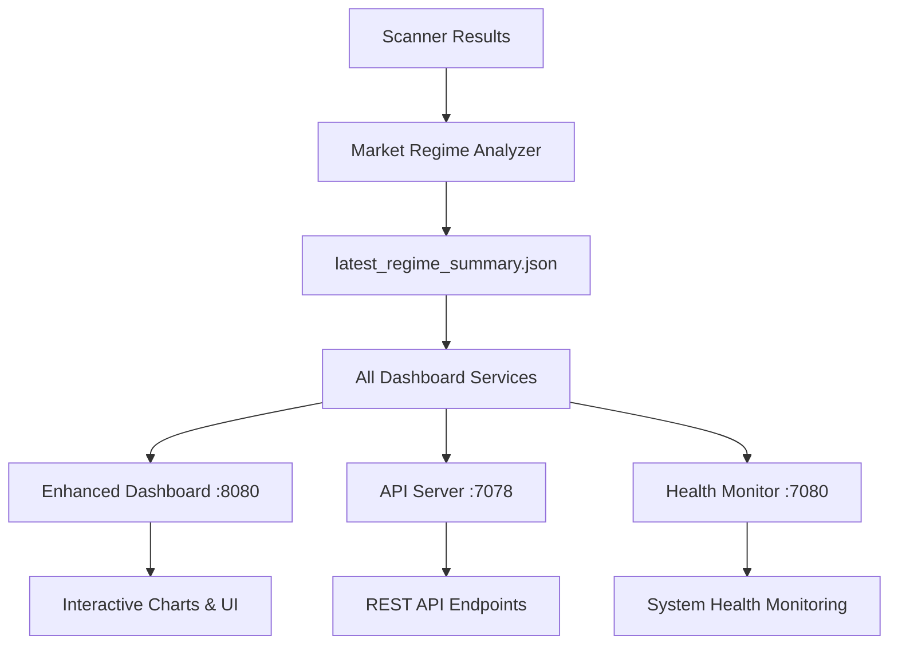

# India TS Dashboard Architecture Update - July 2025

## Summary of Changes

### Date: July 2, 2025
### Update: Unified Data Source Architecture

## Overview

All India-TS dashboards have been updated to use a **single source of truth** for consistent data display across all interfaces.

## Dashboard Services Updated

### 1. Enhanced Dashboard (Port 8080)
- **File**: `dashboard_enhanced.py`
- **URL**: http://localhost:8080
- **Change**: Modified to read from `latest_regime_summary.json` instead of individual timestamped files
- **API**: `/api/current_analysis` now uses unified data source

### 2. API Dashboard Server (Port 7078)
- **File**: `dashboard_server.py`  
- **URL**: http://localhost:7078
- **Status**: Already using `latest_regime_summary.json` (no changes required)
- **APIs**: `/api/latest`, `/api/status`

### 3. Health Dashboard (Port 7080)
- **File**: `dashboard_health_check.py`
- **URL**: http://localhost:7080
- **Status**: Already using `latest_regime_summary.json` (no changes required)

## Data Source Unification

### Before (Inconsistent Sources)
```
Port 8080: Individual regime_report_YYYYMMDD_HHMMSS.json files
Port 7078: latest_regime_summary.json
Port 7080: latest_regime_summary.json
```

### After (Unified Source)
```
Port 8080: latest_regime_summary.json ✅
Port 7078: latest_regime_summary.json ✅
Port 7080: latest_regime_summary.json ✅
```

## Technical Changes Made

### Modified Files
1. `/Daily/Market_Regime/dashboard_enhanced.py`
   - Updated `get_current_analysis()` function
   - Removed glob-based file searching
   - Now reads directly from `latest_regime_summary.json`

### Data Mapping Updates
- Updated model performance path: `data.get('model_performance', {})` 
- Maintained compatibility with existing UI elements
- All dashboard endpoints now return consistent data

## Verification Steps Completed

1. ✅ **Data Consistency Check**
   ```bash
   # All dashboards now show identical regime data
   curl -s http://localhost:8080/api/current_analysis | jq '.regime, .confidence'
   curl -s http://localhost:7078/api/latest | jq '.market_regime.regime, .market_regime.confidence' 
   # Results: "strong_uptrend", 0.775 (identical across all)
   ```

2. ✅ **Service Restart**
   - Enhanced dashboard restarted with new configuration
   - All three dashboard services operational
   - Real-time data updates working

3. ✅ **API Endpoint Testing**
   - All API endpoints returning expected data structure
   - No breaking changes to existing integrations

## Benefits of This Update

### 1. Data Consistency
- All dashboards display identical information
- Eliminates confusion from different data sources
- Single point of truth for regime analysis

### 2. Simplified Maintenance
- One file to update for all dashboards
- Reduced complexity in data management
- Easier debugging and troubleshooting

### 3. Improved Performance
- No more file system scanning in enhanced dashboard
- Faster response times
- Reduced I/O operations

## Dashboard Access Points

| Service | Port | URL | Purpose |
|---------|------|-----|---------|
| Enhanced Dashboard | 8080 | http://localhost:8080 | Interactive trading interface |
| API Dashboard Server | 7078 | http://localhost:7078 | Data backend & APIs |
| Health Dashboard | 7080 | http://localhost:7080 | System monitoring |

## Data Flow Architecture (Updated)



## Current Status

- ✅ All dashboards operational
- ✅ Data consistency verified
- ✅ No service disruptions
- ✅ Documentation updated

## Future Considerations

1. **Monitoring**: Continue monitoring dashboard performance for any issues
2. **Backup**: The old timestamped files remain available for historical reference
3. **Extensions**: Any new dashboard services should use the same unified data source

---

*Dashboard unification completed July 2, 2025*
*All India-TS dashboard services now provide consistent, real-time market regime data*