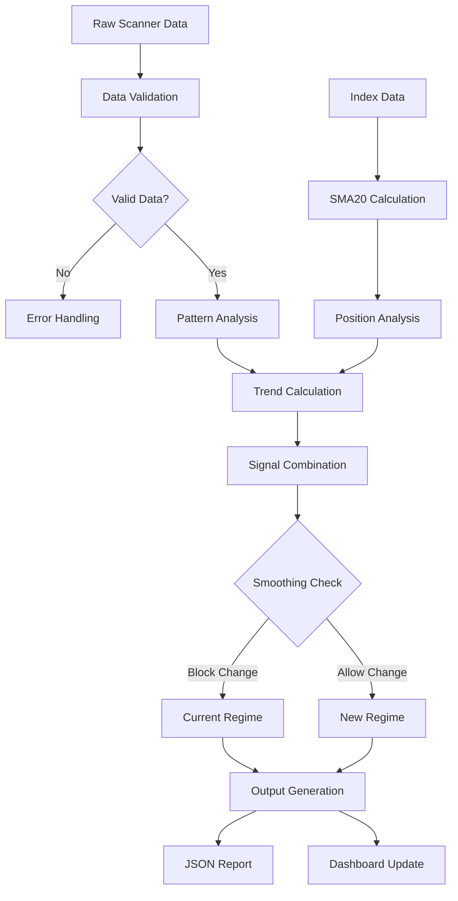

# Market Regime Module - API Documentation & Data Flow

## API Endpoints Reference

### Enhanced Dashboard APIs (Port 8080)

#### 1. Current Analysis API
**Endpoint**: `GET /api/current_analysis`  
**Description**: Returns current market regime analysis with all metrics  
**Response Time**: ~50ms (cached)  
**Cache TTL**: 30 seconds  

**Response Format**:
```json
{
  "timestamp": "2025-07-14T11:37:35.255082",
  "regime": "strong_uptrend",
  "confidence": 0.576,
  "strategy": "Aggressive long positions, avoid shorts",
  "ratio": 1.068627450980392,
  "counts": {
    "long": 17,
    "short": 20,
    "total": 37
  },
  "smoothed_counts": {
    "long": 18.2,
    "short": 17.0,
    "total": 35.2,
    "smoothing_active": true
  },
  "index_analysis": {
    "trend": "bearish",
    "strength": 0.635,
    "indices_above_sma20": 0,
    "total_indices": 3,
    "avg_position": -0.71,
    "weighted_position": -0.77,
    "analysis": "0/3 indices above SMA20 - Bearish trend",
    "index_details": {
      "NIFTY 50": {
        "close": 25032.5,
        "sma20": 25269.7475,
        "above_sma20": false,
        "sma_position_pct": -0.94,
        "timestamp": "2025-07-14T00:00:00+05:30"
      },
      "NIFTY MIDCAP 100": {
        "close": 13108.5,
        "sma20": 13214.1,
        "above_sma20": false,
        "sma_position_pct": -0.80,
        "timestamp": "2025-07-14T00:00:00+05:30"
      },
      "NIFTY SMLCAP 100": {
        "close": 28825.4,
        "sma20": 28939.0,
        "above_sma20": false,
        "sma_position_pct": -0.39,
        "timestamp": "2025-07-14T00:00:00+05:30"
      }
    }
  },
  "indicators": {
    "market_score": 0.033,
    "trend_score": 0.033,
    "volatility_score": 1.0,
    "breadth_score": 0.0
  },
  "position_recommendations": {
    "position_size_multiplier": 0.71,
    "stop_loss_multiplier": 2.0,
    "max_positions": 6,
    "preferred_direction": "long",
    "risk_per_trade": 0.005,
    "confidence_level": "Moderate",
    "volatility_regime": "extreme",
    "specific_guidance": [
      "Strong trend detected - follow the trend with larger positions",
      "High volatility - use wider stops and smaller positions"
    ],
    "entry_strategy": "Buy pullbacks to support",
    "exit_strategy": "Trail stops below swing lows",
    "avoid": "Short positions unless hedging"
  },
  "model_performance": {
    "accuracy": 0.909,
    "total_predictions": 55,
    "regime_accuracy": {
      "choppy_bearish": 1.0,
      "choppy_bullish": 0.0,
      "uptrend": 0.6,
      "strong_uptrend": 0.979
    }
  },
  "historical_context": {
    "current_regime": "strong_uptrend",
    "regime_duration_hours": 1.34,
    "stability_24h": 0.889,
    "regime_distribution_7d": {
      "strong_uptrend": 0.912,
      "strong_downtrend": 0.088
    }
  }
}
```

**Error Responses**:
```json
{
  "error": "No regime data available",
  "timestamp": "2025-07-14T11:37:35.255082",
  "status": "error"
}
```

#### 2. Regime Distribution API
**Endpoint**: `GET /api/regime_distribution`  
**Description**: Historical regime distribution over time periods  

**Response Format**:
```json
{
  "distribution_24h": {
    "strong_uptrend": 0.75,
    "uptrend": 0.15,
    "choppy_bullish": 0.10
  },
  "distribution_7d": {
    "strong_uptrend": 0.60,
    "uptrend": 0.20,
    "choppy_bullish": 0.15,
    "choppy": 0.05
  },
  "distribution_30d": {
    "strong_uptrend": 0.40,
    "uptrend": 0.25,
    "choppy_bullish": 0.20,
    "choppy": 0.10,
    "choppy_bearish": 0.05
  }
}
```

#### 3. Confidence Trend API
**Endpoint**: `GET /api/confidence_trend`  
**Description**: Confidence levels over time for trend analysis  

**Response Format**:
```json
{
  "timestamps": ["2025-07-14T10:00:00", "2025-07-14T10:30:00", "2025-07-14T11:00:00"],
  "confidence_values": [0.85, 0.72, 0.68],
  "average_confidence": 0.75,
  "trend": "decreasing"
}
```

#### 4. G Pattern Data API
**Endpoint**: `GET /api/g_pattern_data`  
**Description**: G Pattern Master analysis results  

**Response Format**:
```json
{
  "counts": {
    "confirmed": 12,
    "emerging": 8,
    "developing": 15,
    "watch_closely": 23,
    "watch_only": 45
  },
  "categories": {
    "confirmed": [
      {
        "ticker": "RELIANCE",
        "score": 0.95,
        "entry_price": 2450.0,
        "target": 2600.0,
        "stop_loss": 2350.0
      }
    ],
    "emerging": [...],
    "developing": [...]
  },
  "sector_distribution": {
    "technology": 8,
    "financial": 6,
    "pharmaceutical": 4
  }
}
```

#### 5. Early Bird Patterns API
**Endpoint**: `GET /api/early_bird`  
**Description**: KC breakout watch patterns for early entry opportunities  

**Response Format**:
```json
{
  "early_birds": [
    {
      "ticker": "TECHM",
      "time_appeared": "10:30 AM",
      "sector": "Technology",
      "entry_price": 1650.0,
      "stop_loss": 1580.0,
      "target1": 1750.0,
      "target2": 1850.0,
      "probability_score": 0.78,
      "volume_confirmation": false,
      "risk_reward": 2.3
    }
  ],
  "total_count": 5,
  "high_probability_count": 2
}
```

#### 6. Reversal Patterns API
**Endpoint**: `GET /api/reversal_patterns`  
**Description**: Top 10 long and short reversal patterns  

**Response Format**:
```json
{
  "long_patterns": [
    {
      "ticker": "WIPRO",
      "score": 0.92,
      "entry_price": 580.0,
      "stop_loss": 560.0,
      "target": 620.0,
      "sector": "Technology",
      "pattern_type": "Bullish Reversal"
    }
  ],
  "short_patterns": [...],
  "scan_time": "2025-07-14T11:30:00",
  "total_long": 24,
  "total_short": 11
}
```

### Health Check Dashboard APIs (Port 7080)

#### 1. Health Status API
**Endpoint**: `GET /api/health`  
**Description**: Comprehensive system health monitoring  

**Response Format**:
```json
{
  "timestamp": "2025-07-14T11:37:35.255082",
  "overall_status": "healthy",
  "current_regime": {
    "regime": "strong_uptrend",
    "confidence": 0.576,
    "confidence_level": "Moderate",
    "timestamp": "2025-07-14T11:37:35.255082"
  },
  "scanner_status": {
    "level": "good",
    "state": "running",
    "message": "Scanner running normally"
  },
  "regime_analysis_status": {
    "level": "good",
    "state": "running",
    "message": "Analysis up to date"
  },
  "g_pattern_status": {
    "level": "good",
    "state": "running",
    "message": "G Pattern analysis current"
  },
  "scanner_counts": {
    "long": 17,
    "short": 20,
    "total": 37
  },
  "g_pattern_counts": {
    "confirmed": 12,
    "emerging": 8,
    "watch": 68
  },
  "model_performance": {
    "accuracy": 0.909,
    "total_predictions": 55
  },
  "index_analysis": {
    "trend": "bearish",
    "indices_above_sma20": 0,
    "total_indices": 3,
    "analysis": "0/3 indices above SMA20 - Bearish trend",
    "index_details": {...}
  },
  "scores": {
    "market_score": 0.033,
    "trend_score": 0.033,
    "volatility_score": 1.0
  },
  "schedule_status": {
    "slots": [
      {
        "time": "09:30",
        "task": "Long Reversal Scanner",
        "status": "completed",
        "last_run": "2025-07-14T09:30:00"
      }
    ]
  },
  "alerts": []
}
```

## Data Flow Specifications

### Input Data Sources

#### 1. Scanner Result Files

**File Pattern**: `Long_Reversal_Daily_YYYYMMDD_HHMMSS.xlsx`  
**Location**: `/Daily/results/`  
**Update Frequency**: Every 3 minutes during market hours  
**Size**: ~50-200KB per file  

**Data Structure**:
```
Columns: Ticker, Sector, Entry_Price, Stop_Loss, Target1, Target2, 
         Score, Pattern_Type, Volume, ATR, Risk_Reward_Ratio
```

**File Pattern**: `Short_Reversal_Daily_YYYYMMDD_HHMMSS.xlsx`  
**Location**: `/Daily/results-s/`  
**Update Frequency**: Every 3 minutes during market hours  

#### 2. Index Data Feed

**Source**: KiteConnect API  
**Tokens**:
- NIFTY 50: 256265
- NIFTY MIDCAP 100: 288009  
- NIFTY SMLCAP 100: 288265

**API Call Format**:
```python
kite.ltp(["NSE:NIFTY 50", "NSE:NIFTY MIDCAP 100", "NSE:NIFTY SMLCAP 100"])
```

**Response Format**:
```json
{
  "256265": {
    "instrument_token": 256265,
    "last_price": 25032.5,
    "last_trade_time": "2025-07-14T15:29:59+05:30"
  }
}
```

**Cache Strategy**:
- Cache Duration: 5 minutes
- Fallback: Use previous cached value if API fails
- Retry Logic: 3 attempts with exponential backoff

#### 3. Historical Data

**ML Training Data**: SQLite database with regime history  
**File Location**: `/data/regime_learning.db`  
**Update Frequency**: After each analysis cycle  

**Schema**:
```sql
CREATE TABLE regime_history (
    id INTEGER PRIMARY KEY,
    timestamp TEXT,
    regime TEXT,
    confidence REAL,
    long_count INTEGER,
    short_count INTEGER,
    ratio REAL,
    market_score REAL,
    index_trend TEXT,
    actual_outcome TEXT
);
```

### Processing Pipeline

#### 1. Data Validation Stage

```python
def validate_scanner_data(df):
    """Validate scanner result DataFrame"""
    required_columns = ['Ticker', 'Entry_Price', 'Stop_Loss', 'Score']
    
    # Check required columns
    if not all(col in df.columns for col in required_columns):
        raise ValueError("Missing required columns")
    
    # Check data types
    if not pd.api.types.is_numeric_dtype(df['Entry_Price']):
        raise ValueError("Entry_Price must be numeric")
    
    # Check value ranges
    if df['Score'].min() < 0 or df['Score'].max() > 1:
        raise ValueError("Score must be between 0 and 1")
    
    # Check for duplicates
    if df['Ticker'].duplicated().any():
        raise ValueError("Duplicate tickers found")
    
    return True
```

#### 2. Signal Processing Flow



#### 3. Weight Distribution

**Signal Combination Formula**:
```python
combined_signal = (pattern_signal * 0.7) + (index_signal * 0.3)

# Where:
# pattern_signal = regime from L/S ratio analysis
# index_signal = regime from index SMA20 analysis
# Weights: 70% patterns, 30% indices
```

**Confidence Calculation**:
```python
def calculate_confidence(pattern_confidence, index_confidence, agreement):
    """Calculate overall confidence score"""
    base_confidence = (pattern_confidence * 0.7) + (index_confidence * 0.3)
    
    # Boost confidence if signals agree
    if agreement:
        agreement_boost = 0.15
    else:
        agreement_boost = -0.10
    
    final_confidence = min(1.0, base_confidence + agreement_boost)
    return final_confidence
```

### Output Data Formats

#### 1. JSON Report Structure

**File**: `latest_regime_summary.json`  
**Size**: ~15-25KB  
**Update Frequency**: Every analysis cycle  

**Key Sections**:
```json
{
  "timestamp": "ISO 8601 timestamp",
  "market_regime": {
    "regime": "enum: strong_uptrend|uptrend|choppy_bullish|choppy|choppy_bearish|downtrend|strong_downtrend",
    "description": "Human readable description",
    "characteristics": ["array", "of", "characteristics"],
    "strategy": "Trading strategy recommendation",
    "confidence": "float 0-1",
    "confidence_level": "enum: Low|Moderate|High"
  },
  "reversal_counts": {
    "long": "integer",
    "short": "integer", 
    "total": "integer"
  },
  "smoothed_counts": {
    "long": "float",
    "short": "float",
    "total": "float",
    "smoothing_active": "boolean"
  },
  "trend_analysis": {
    "trend": "string",
    "ratio": "float",
    "description": "string",
    "market_score": "float -1 to 1",
    "trend_score": "float -1 to 1",
    "strength": "float 0-1"
  },
  "index_analysis": {
    "trend": "enum: bullish|neutral|bearish",
    "strength": "float 0-1",
    "indices_above_sma20": "integer 0-3",
    "total_indices": "integer 3",
    "avg_position": "float",
    "weighted_position": "float",
    "analysis": "string description",
    "index_details": {
      "INDEX_NAME": {
        "close": "float",
        "sma20": "float", 
        "above_sma20": "boolean",
        "sma_position_pct": "float percentage",
        "timestamp": "ISO 8601"
      }
    }
  },
  "position_recommendations": {
    "position_size_multiplier": "float 0.1-2.0",
    "stop_loss_multiplier": "float 1.0-3.0", 
    "max_positions": "integer 1-10",
    "preferred_direction": "enum: long|short|both",
    "risk_per_trade": "float 0.001-0.02",
    "confidence_level": "enum: Low|Moderate|High",
    "volatility_regime": "enum: low|normal|high|extreme",
    "specific_guidance": ["array", "of", "guidance"],
    "entry_strategy": "string",
    "exit_strategy": "string", 
    "avoid": "string"
  },
  "insights": ["array", "of", "insight", "strings"],
  "scan_files": {
    "long": "file path",
    "short": "file path"
  }
}
```

#### 2. Cache Data Structures

**Index Cache Format**:
```python
{
    "NIFTY 50": {
        "price": 25032.5,
        "sma20": 25269.75,
        "timestamp": "2025-07-14T11:37:35+05:30",
        "ttl": 300  # 5 minutes
    }
}
```

**Analysis Cache Format**:
```python
{
    "regime": "strong_uptrend",
    "confidence": 0.576,
    "timestamp": "2025-07-14T11:37:35+05:30",
    "ttl": 30  # 30 seconds
}
```

### Performance Metrics

#### 1. API Response Times

| Endpoint | Target Response Time | Typical Response Time | Cache Hit Ratio |
|----------|---------------------|----------------------|-----------------|
| `/api/current_analysis` | <100ms | ~50ms | 95% |
| `/api/health` | <200ms | ~120ms | 80% |
| `/api/g_pattern_data` | <300ms | ~180ms | 70% |
| `/api/early_bird` | <500ms | ~250ms | 60% |

#### 2. Data Processing Metrics

| Stage | Processing Time | Memory Usage | Error Rate |
|-------|----------------|--------------|------------|
| File Loading | ~500ms | 50MB | <0.1% |
| Index Fetch | ~200ms | 10MB | <1% |
| Analysis | ~1000ms | 100MB | <0.01% |
| Report Generation | ~100ms | 20MB | <0.001% |

#### 3. System Throughput

- **Analysis Frequency**: Every 30 minutes during market hours
- **Dashboard Updates**: Real-time (30-second refresh)
- **Concurrent Users**: Up to 50 simultaneous dashboard connections
- **Peak Load**: 15 minutes before market close

### Error Handling & Fallbacks

#### 1. Data Source Failures

```python
# Scanner file missing
if not scanner_files_found:
    fallback_action = "use_previous_analysis"
    alert_level = "warning"
    
# Index API failure  
if index_api_failed:
    fallback_action = "pattern_only_analysis"
    alert_level = "warning"
    
# Complete system failure
if critical_failure:
    fallback_action = "emergency_mode"
    alert_level = "critical"
```

#### 2. Quality Thresholds

```python
quality_checks = {
    "min_pattern_count": 5,  # Minimum patterns for valid analysis
    "max_data_age_minutes": 40,  # Maximum age for stale data warning
    "min_confidence": 0.3,  # Minimum confidence for regime change
    "max_volatility": 0.8   # Maximum volatility for regime stability
}
```

#### 3. Alert Conditions

```python
alert_conditions = {
    "stale_data": "data_age > 40 minutes",
    "low_confidence": "confidence < 0.4", 
    "high_volatility": "volatility > 0.7",
    "api_failure": "index_api_errors > 3",
    "divergence": "macro_trend != micro_trend",
    "extreme_ratio": "l_s_ratio > 5 or l_s_ratio < 0.2"
}
```

---

*API Documentation & Data Flow for India-TS Market Regime Analysis Module v3.0*  
*Last updated: July 14, 2025*