# Market Regime Module - Architecture Diagrams

## System Architecture Overview


## Component Interaction Diagram


## Data Flow Architecture

```mermaid
flowchart TD
    subgraph "Data Sources"
        DS1["📊 Long Reversals<br/>Daily/results/*.xlsx"]
        DS2["📊 Short Reversals<br/>Daily/results-s/*.xlsx"]
        DS3["📈 NIFTY 50<br/>Token: 256265"]
        DS4["📈 NIFTY MIDCAP<br/>Token: 288009"]
        DS5["📈 NIFTY SMALLCAP<br/>Token: 288265"]
    end
    
    subgraph "Data Processing"
        DP1["🔄 Load & Validate<br/>Excel → DataFrame"]
        DP2["🔄 Fetch Index Data<br/>KiteConnect API"]
        DP3["🔄 Calculate SMA20<br/>20-period average"]
    end
    
    subgraph "Analysis Engine"
        AE1["📊 Pattern Analysis<br/>Long/Short Ratio"]
        AE2["📈 Index Analysis<br/>Above/Below SMA20"]
        AE3["🤖 ML Prediction<br/>Regime Classification"]
        AE4["⚖️ Signal Combination<br/>70% Pattern + 30% Index"]
    end
    
    subgraph "Filtering & Validation"
        FV1["🕐 Regime Smoother<br/>Min 2hr Duration"]
        FV2["📊 Confidence Check<br/>Min 70% Threshold"]
        FV3["📈 Volatility Filter<br/>Max 50% Volatility"]
    end
    
    subgraph "Output Generation"
        OG1["📄 JSON Report<br/>latest_regime_summary.json"]
        OG2["🌐 Static Dashboard<br/>HTML Generation"]
        OG3["⚡ Real-time API<br/>Flask Endpoints"]
        OG4["🏥 Health Monitor<br/>System Status"]
    end
    
    DS1 --> DP1
    DS2 --> DP1
    DS3 --> DP2
    DS4 --> DP2
    DS5 --> DP2
    DP2 --> DP3
    
    DP1 --> AE1
    DP3 --> AE2
    AE1 --> AE3
    AE2 --> AE3
    AE1 --> AE4
    AE2 --> AE4
    AE3 --> AE4
    
    AE4 --> FV1
    FV1 --> FV2
    FV2 --> FV3
    
    FV3 --> OG1
    OG1 --> OG2
    OG1 --> OG3
    OG1 --> OG4
```



## Service Architecture


## Integration Architecture


## Deployment Architecture


## Security Architecture


## Performance Architecture


---

## Component Relationships

### Core Dependencies


### Data Dependencies

```mermaid
flowchart LR
    subgraph "Input Dependencies"
        I1[Scanner Excel Files]
        I2[KiteConnect API Access]
        I3[Historical ML Data]
    end
    
    subgraph "Processing Dependencies"
        P1[Python 3.8+]
        P2[pandas, numpy]
        P3[scikit-learn]
        P4[Flask, requests]
    end
    
    subgraph "Output Dependencies"
        O1[Web Server (nginx)]
        O2[File System Access]
        O3[Network Ports 5001,8080,7080]
    end
    
    I1 --> P1
    I2 --> P2
    I3 --> P3
    P1 --> O1
    P2 --> O2
    P4 --> O3
```

---

*Architecture diagrams for India-TS Market Regime Analysis Module v3.0*  
*Generated: July 14, 2025*