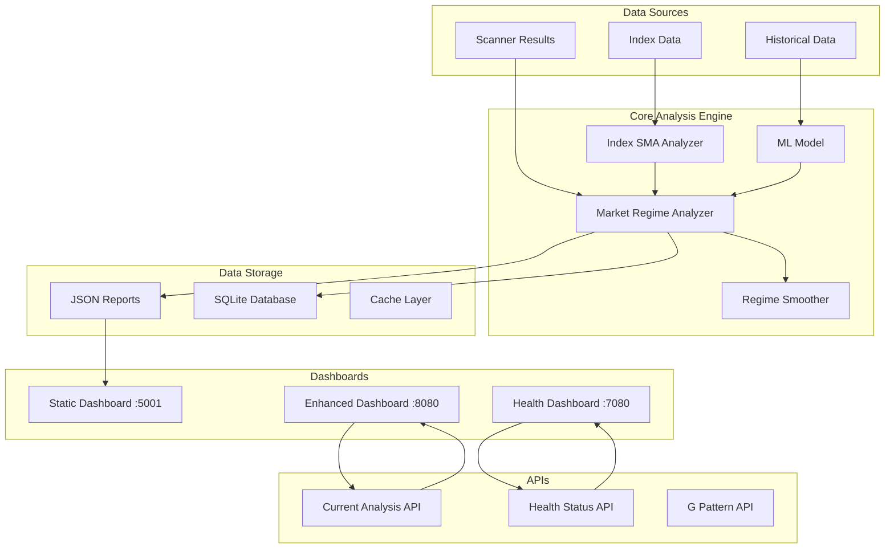
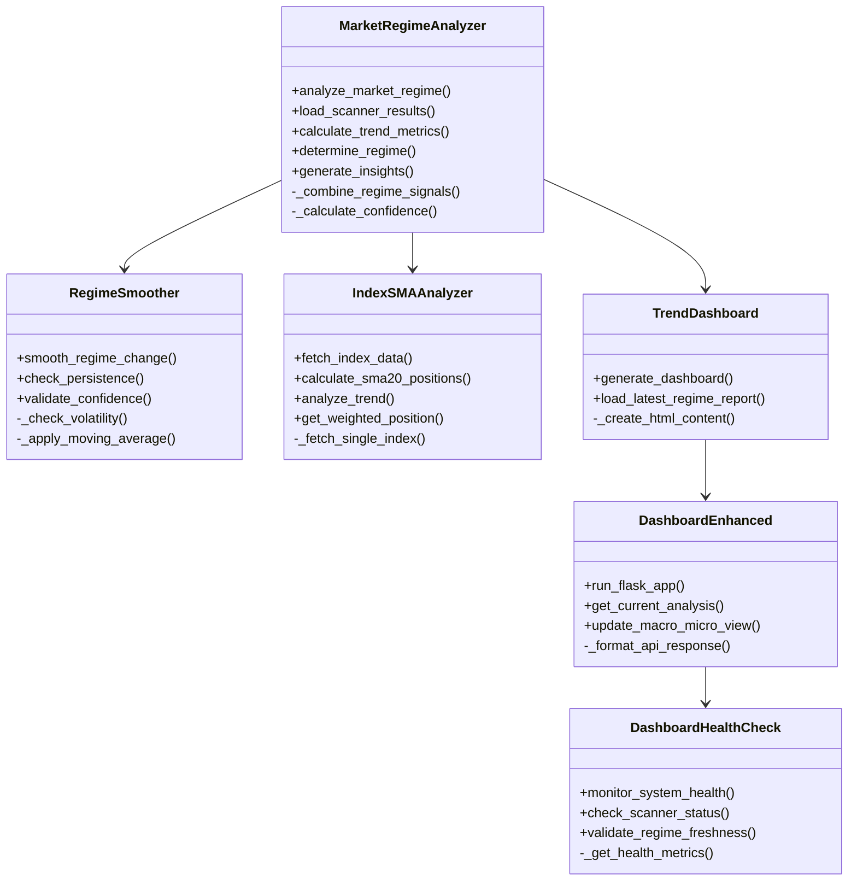
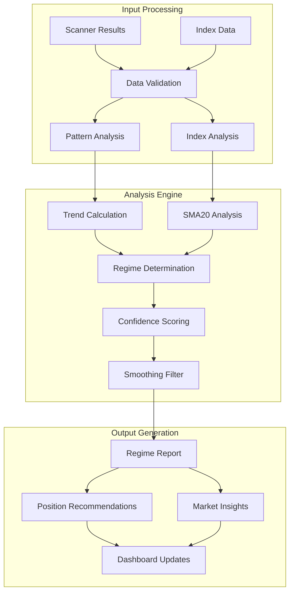
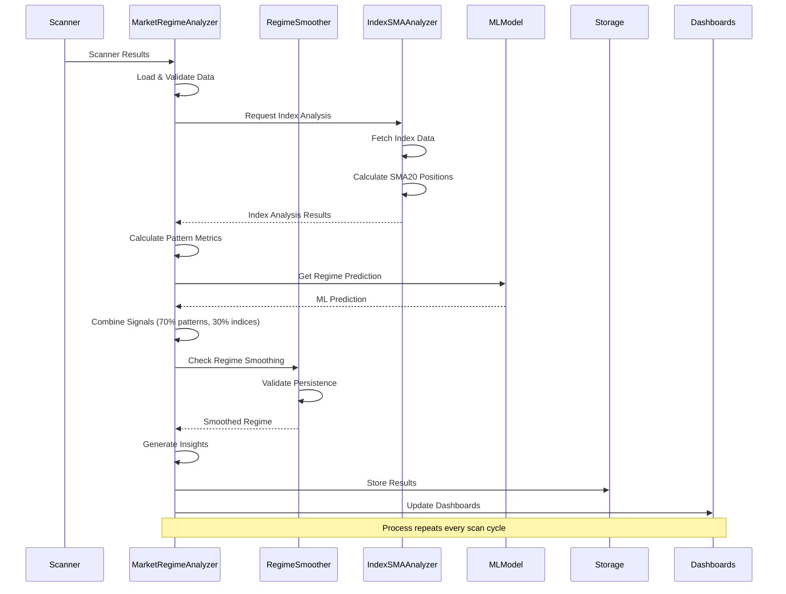
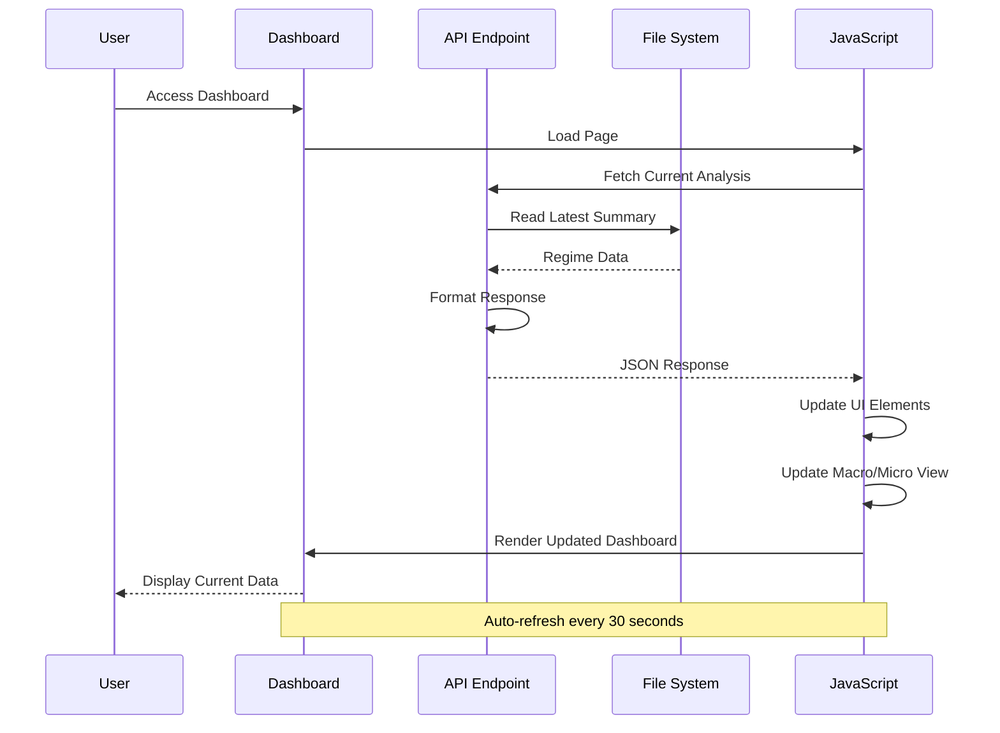
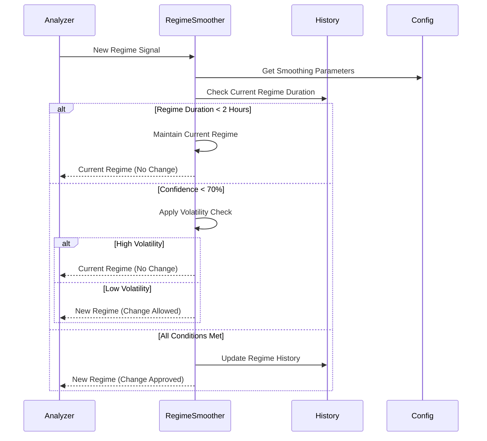
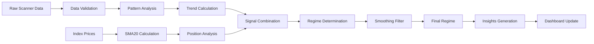

# Market Regime Analysis Module - Comprehensive Documentation

## Table of Contents
1. [Overview](#overview)
2. [Architecture](#architecture)
3. [Component Diagrams](#component-diagrams)
4. [Module Structure](#module-structure)
5. [Sequence Diagrams](#sequence-diagrams)
6. [Data Flow](#data-flow)
7. [API Endpoints](#api-endpoints)
8. [Configuration](#configuration)
9. [Installation & Setup](#installation--setup)
10. [Usage Examples](#usage-examples)
11. [Troubleshooting](#troubleshooting)

## Overview

The Market Regime Analysis Module is a sophisticated system designed to analyze market conditions and provide real-time trading insights. It combines pattern recognition, index analysis, and machine learning to determine market regimes and provide actionable trading recommendations.

### Key Features
- **Real-time Market Regime Detection**: Identifies 7 distinct market regimes
- **Macro/Micro Analysis**: Combines index-based (macro) and pattern-based (micro) views
- **Regime Smoothing**: Prevents frequent regime changes with persistence requirements
- **Multi-Dashboard System**: Three specialized dashboards for different use cases
- **Machine Learning Integration**: ML model for regime prediction with 90%+ accuracy
- **Index SMA20 Analysis**: Monitors NIFTY 50, MIDCAP 100, and SMALLCAP 100
- **Position Recommendations**: Dynamic position sizing and risk management

### Market Regimes
1. **Strong Uptrend**: Aggressive bullish conditions
2. **Uptrend**: Moderate bullish conditions  
3. **Choppy Bullish**: Volatile but bullish-leaning
4. **Choppy**: Neutral/sideways market
5. **Choppy Bearish**: Volatile but bearish-leaning
6. **Downtrend**: Moderate bearish conditions
7. **Strong Downtrend**: Aggressive bearish conditions

## Architecture

### High-Level Architecture Diagram



## Component Diagrams

### Core Components



### Data Flow Components



## Module Structure

```
Daily/Market_Regime/
├── __init__.py
├── market_regime_analyzer.py      # Core analysis engine
├── regime_smoother.py             # Regime smoothing logic
├── index_sma_analyzer.py          # Index SMA20 analysis
├── trend_dashboard.py             # Static dashboard generator
├── dashboard_enhanced.py          # Enhanced Flask dashboard
├── dashboard_health_check.py      # Health monitoring dashboard
├── regime_analysis/               # Analysis results
│   ├── latest_regime_summary.json
│   └── regime_report_*.json
├── dashboards/                    # Generated dashboards
│   └── market_regime_dashboard.html
├── data/                         # Cached data
├── scan_results/                 # Scanner result cache
└── trend_analysis/              # Historical analysis
```

### Key Files Description

| File | Purpose | Key Functions |
|------|---------|---------------|
| `market_regime_analyzer.py` | Main analysis engine | `analyze_market_regime()`, `_combine_regime_signals()` |
| `regime_smoother.py` | Prevents rapid regime changes | `smooth_regime_change()`, `check_persistence()` |
| `index_sma_analyzer.py` | Index SMA20 analysis | `fetch_index_data()`, `analyze_trend()` |
| `trend_dashboard.py` | Static HTML dashboard | `generate_dashboard()` |
| `dashboard_enhanced.py` | Real-time Flask dashboard | Flask routes, API endpoints |
| `dashboard_health_check.py` | System monitoring | Health checks, status monitoring |

## Sequence Diagrams

### Market Regime Analysis Flow



### Dashboard Update Flow



### Regime Smoothing Logic



## Data Flow

### Input Data Sources

1. **Scanner Results**
   - Long reversal patterns from `results/Long_Reversal_Daily_*.xlsx`
   - Short reversal patterns from `results-s/Short_Reversal_Daily_*.xlsx`
   - Pattern scores, entry prices, stop losses

2. **Index Data** 
   - NIFTY 50 (Token: 256265)
   - NIFTY MIDCAP 100 (Token: 288009)  
   - NIFTY SMLCAP 100 (Token: 288265)
   - Real-time prices and SMA20 calculations

3. **Historical Data**
   - Previous regime states
   - ML training data
   - Performance metrics

### Processing Pipeline



### Output Data

1. **Regime Reports** (`regime_analysis/`)
   - Current regime and confidence
   - Pattern counts and ratios
   - Index analysis results
   - Position recommendations

2. **Dashboard Data**
   - Static HTML files
   - Real-time API responses
   - Health status information

3. **Insights**
   - Trading recommendations
   - Risk assessments
   - Market condition summaries

## API Endpoints

### Enhanced Dashboard (Port 8080)

| Endpoint | Method | Description | Response Format |
|----------|--------|-------------|-----------------|
| `/api/current_analysis` | GET | Current regime analysis | JSON with regime, confidence, indicators |
| `/api/regime_distribution` | GET | Historical regime distribution | JSON with regime percentages |
| `/api/confidence_trend` | GET | Confidence trend over time | JSON with time series data |
| `/api/metric_history/<metric>` | GET | Historical metric data | JSON with metric history |
| `/api/g_pattern_data` | GET | G Pattern analysis | JSON with pattern categories |
| `/api/early_bird` | GET | Early bird opportunities | JSON with KC breakout patterns |
| `/api/reversal_patterns` | GET | Current reversal patterns | JSON with top patterns |

### Health Check Dashboard (Port 7080)

| Endpoint | Method | Description | Response Format |
|----------|--------|-------------|-----------------|
| `/api/health` | GET | System health status | JSON with health metrics |

### Sample API Response

```json
{
  "timestamp": "2025-07-14T11:37:35.255082",
  "regime": "strong_uptrend",
  "confidence": 0.576,
  "ratio": 1.068627450980392,
  "counts": {
    "long": 17,
    "short": 20,
    "total": 37
  },
  "index_analysis": {
    "trend": "bearish",
    "indices_above_sma20": 0,
    "total_indices": 3,
    "index_details": {
      "NIFTY 50": {
        "close": 25032.5,
        "sma20": 25269.7475,
        "above_sma20": false,
        "sma_position_pct": -0.9388597966798097
      }
    }
  },
  "position_recommendations": {
    "position_size_multiplier": 0.71,
    "stop_loss_multiplier": 2.0,
    "max_positions": 6,
    "preferred_direction": "long"
  }
}
```

## Configuration

### Regime Smoother Configuration

```python
self.config = {
    'min_regime_duration_hours': 2.0,      # Minimum time before regime change
    'confidence_threshold': 0.7,           # Minimum confidence for change
    'ma_periods': 3,                       # Moving average periods
    'extreme_ratio_threshold': 3.0,        # Extreme ratio threshold
    'volatility_window': 5,                # Volatility calculation window
    'max_volatility': 0.5                  # Maximum allowed volatility
}
```

### Index Analyzer Configuration

```python
self.index_tokens = {
    'NIFTY 50': 256265,
    'NIFTY MIDCAP 100': 288009,
    'NIFTY SMLCAP 100': 288265
}

self.sma_period = 20  # SMA calculation period
```

### Signal Combination Weights

```python
# Weight for index analysis vs pattern analysis
index_weight = 0.3     # 30% weight to index analysis
pattern_weight = 0.7   # 70% weight to pattern analysis
```

## Installation & Setup

### Prerequisites

```bash
# Required Python packages
pip install flask pandas numpy scikit-learn requests pytz
```

### Directory Structure Setup

```bash
cd Daily/Market_Regime
mkdir -p regime_analysis dashboards data scan_results trend_analysis
```

### Configuration Files

1. **KiteConnect Setup** (in parent directory)
   - Ensure `loginz.py` contains valid API credentials
   - Configure access tokens for index data fetch

2. **Scanner Integration**
   - Ensure scanner results are available in `Daily/results/` and `Daily/results-s/`
   - Configure scanner to run before regime analysis

### Service Setup

1. **Static Dashboard (Port 5001)**
   ```bash
   python3 trend_dashboard.py
   # Generates HTML file served by external web server
   ```

2. **Enhanced Dashboard (Port 8080)**
   ```bash
   python3 dashboard_enhanced.py &
   # Starts Flask server on port 8080
   ```

3. **Health Check Dashboard (Port 7080)**
   ```bash
   python3 dashboard_health_check.py &
   # Starts Flask server on port 7080
   ```

## Usage Examples

### Manual Analysis

```python
from market_regime_analyzer import MarketRegimeAnalyzer

# Initialize analyzer
analyzer = MarketRegimeAnalyzer()

# Run analysis
results = analyzer.analyze_market_regime()

# Access results
print(f"Current Regime: {results['market_regime']['regime']}")
print(f"Confidence: {results['market_regime']['confidence']:.1%}")
print(f"Strategy: {results['market_regime']['strategy']}")
```

### API Usage

```python
import requests

# Get current analysis
response = requests.get('http://localhost:8080/api/current_analysis')
data = response.json()

# Check for divergence
macro_trend = data['index_analysis']['trend']
micro_regime = data['regime']

if 'bearish' in macro_trend and 'uptrend' in micro_regime:
    print("⚠️ Divergence detected - Reduce position sizes")
```

### Dashboard Integration

```html
<!-- Include in your trading dashboard -->
<iframe src="http://localhost:8080" width="100%" height="800px"></iframe>

<!-- Or fetch data via JavaScript -->
<script>
fetch('/api/current_analysis')
  .then(response => response.json())
  .then(data => {
    document.getElementById('regime').textContent = data.regime;
    document.getElementById('confidence').textContent = 
      (data.confidence * 100).toFixed(1) + '%';
  });
</script>
```

## Troubleshooting

### Common Issues

1. **"No regime data available" Error**
   - **Cause**: Scanner results not found or invalid
   - **Solution**: Ensure scanner has run and produced valid Excel files
   - **Check**: Verify files exist in `Daily/results/` and `Daily/results-s/`

2. **Index Data Fetch Failures**
   - **Cause**: KiteConnect API issues or invalid tokens
   - **Solution**: Check `loginz.py` credentials and API limits
   - **Fallback**: System continues with pattern-only analysis

3. **Dashboard Not Loading**
   - **Cause**: Port conflicts or Flask server issues
   - **Solution**: Check if ports 5001, 8080, 7080 are available
   - **Debug**: Check server logs for specific error messages

4. **Stale Data Warnings**
   - **Cause**: Analysis hasn't run recently
   - **Solution**: Check if scanner is running on schedule
   - **Monitor**: Health dashboard shows data age warnings

### Debug Commands

```bash
# Check if analysis files exist
ls -la regime_analysis/

# Test API endpoints
curl http://localhost:8080/api/current_analysis

# Check dashboard processes
ps aux | grep dashboard

# View recent logs
tail -f /tmp/dashboard_enhanced.log
```

### Performance Optimization

1. **Caching**: Index data is cached to reduce API calls
2. **Batch Processing**: Scanner results processed in batches
3. **Async Updates**: Dashboard updates don't block analysis
4. **Data Pruning**: Old analysis files automatically cleaned

### Monitoring

The system includes comprehensive monitoring:

- **Health Dashboard**: Real-time system status
- **API Responsiveness**: Endpoint health checks  
- **Data Freshness**: Alerts for stale data
- **Regime Stability**: Tracks regime change frequency
- **Model Performance**: ML prediction accuracy monitoring

---

## Integration with Main System

This Market Regime Module integrates seamlessly with the main India-TS trading system:

- **Scanner Integration**: Consumes scanner results automatically
- **Position Management**: Provides position sizing recommendations
- **Risk Management**: Influences stop-loss and risk parameters  
- **Dashboard Ecosystem**: Complements existing trading dashboards
- **API Compatibility**: RESTful APIs for external integrations

For more information on the broader system architecture, see:
- [INDIA_TS_3.0_OVERVIEW.md](./INDIA_TS_3.0_OVERVIEW.md)
- [INDIA_TS_3.0_COMPONENT_DIAGRAMS.md](./INDIA_TS_3.0_COMPONENT_DIAGRAMS.md)
- [INDIA_TS_3.0_DASHBOARD_ARCHITECTURE.md](./INDIA_TS_3.0_DASHBOARD_ARCHITECTURE.md)

---

*Documentation generated for India-TS Market Regime Analysis Module v3.0*  
*Last updated: July 14, 2025*