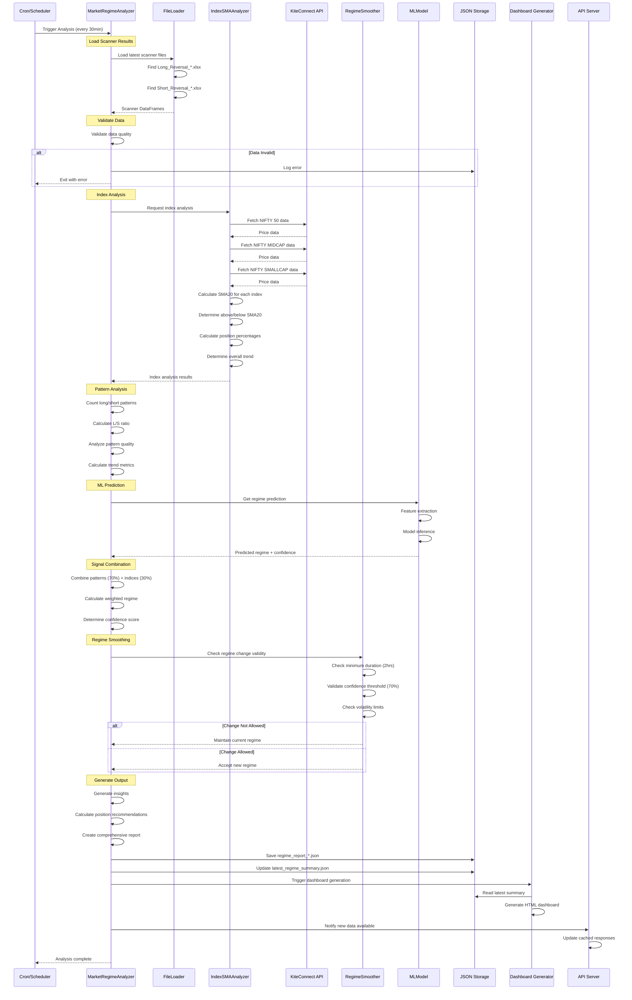
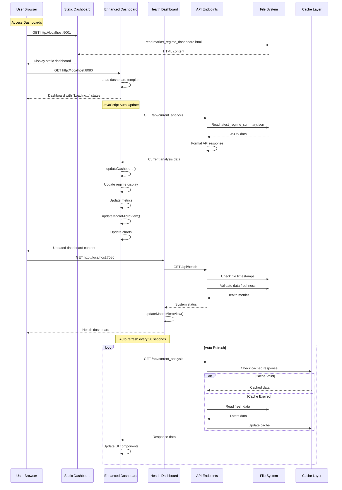
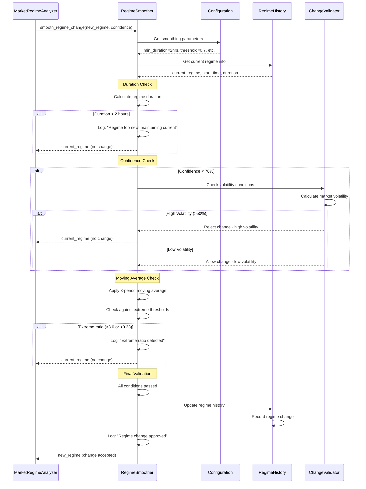
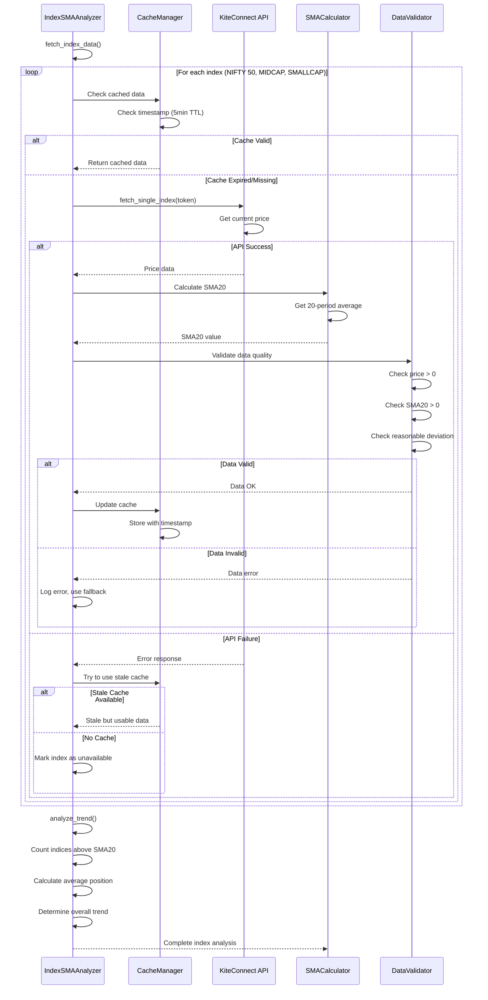
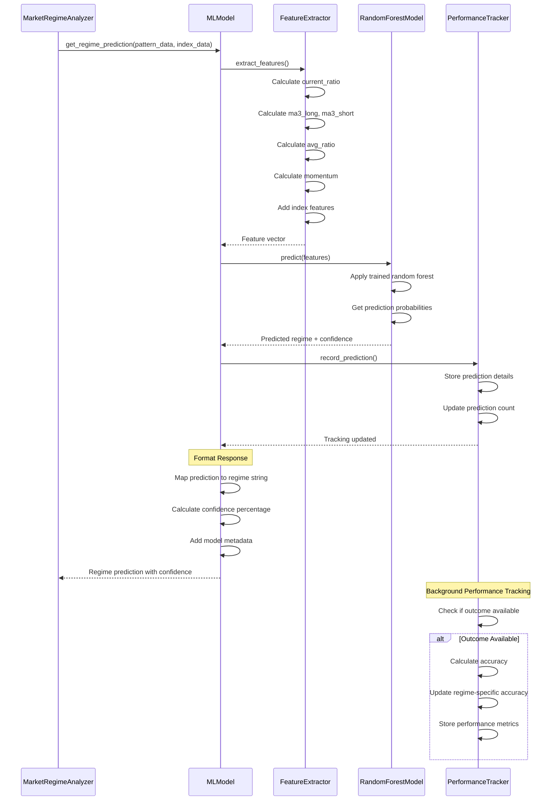
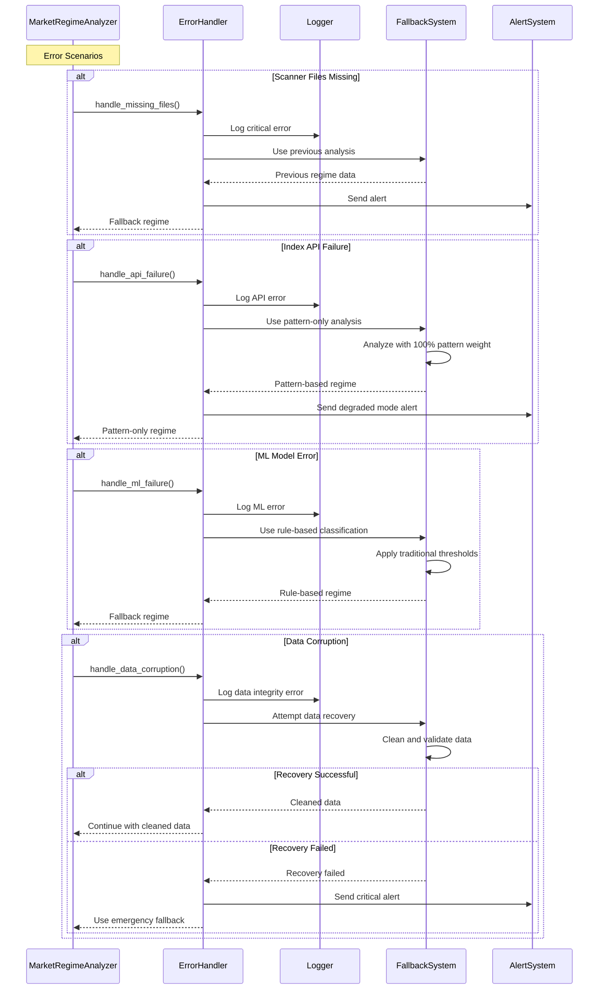
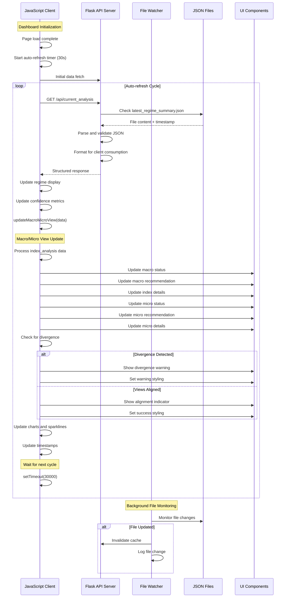
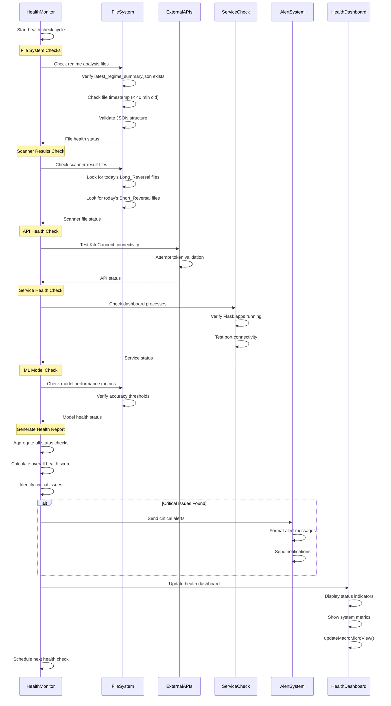

# Market Regime Module - Sequence Diagrams

## Complete Analysis Workflow

## Dashboard Update Sequence

## Regime Smoothing Logic Flow

## Index Data Fetching Workflow

## ML Model Integration Flow

## Error Handling and Recovery

## Dashboard Real-time Update Flow

## System Health Monitoring Flow

---

## Key Sequence Patterns

### 1. **Error-First Design**
All sequences include comprehensive error handling with graceful degradation.

### 2. **Caching Strategy**
Data fetching sequences implement multi-level caching for performance.

### 3. **Real-time Updates**
Dashboard sequences show how real-time data flows to users.

### 4. **Validation Gates**
Each sequence includes validation checkpoints to ensure data quality.

### 5. **Monitoring Integration**
All flows include monitoring and alerting touchpoints.

---

*Sequence diagrams for India-TS Market Regime Analysis Module v3.0*  
*Generated: July 14, 2025*